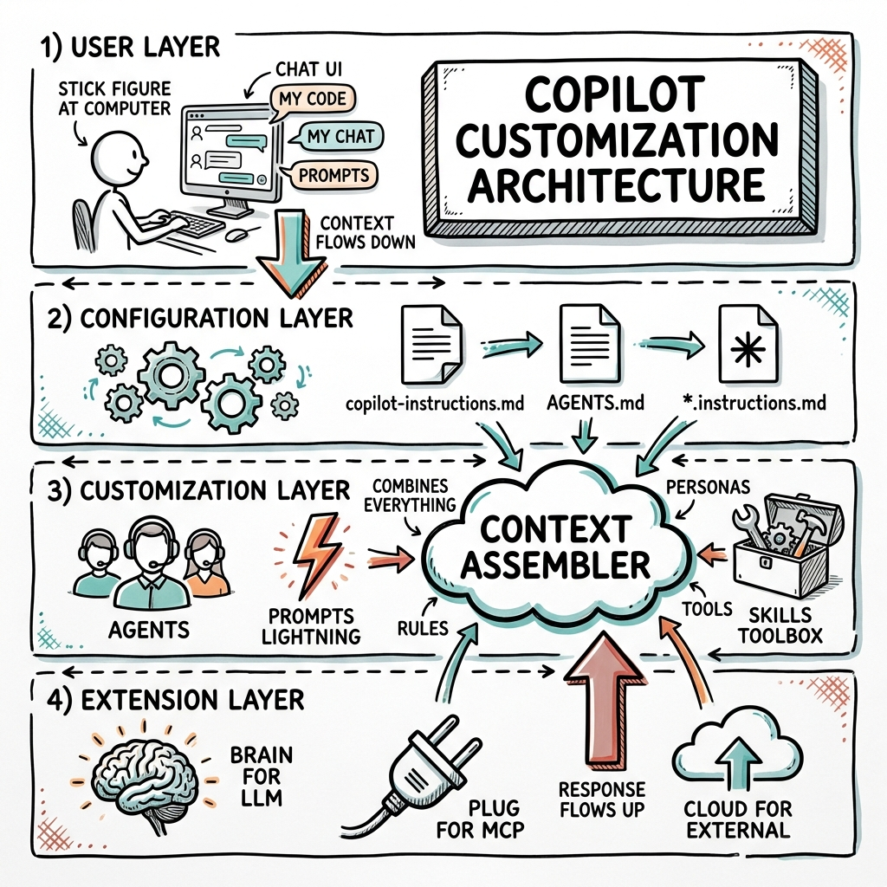
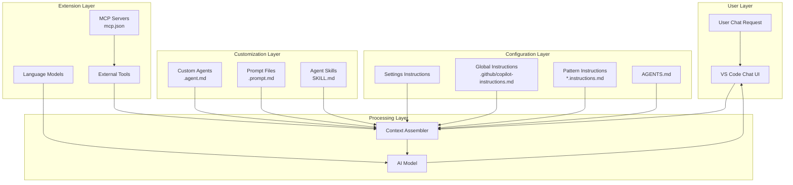
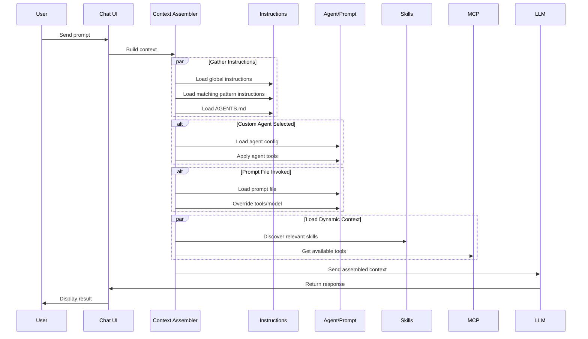

# VS Code Copilot Customization Architecture

> **Understanding the Context Flow and Integration Points**

This document explains the architectural design of VS Code Copilot's customization system and the reasoning behind each component.

---

## Architecture Overview





---

## Component Breakdown

### 1. Configuration Layer

The foundation of customization - persistent settings applied automatically.

```
┌─────────────────────────────────────────────────────────────────────────┐
│                        CONFIGURATION LAYER                              │
├─────────────────────────────────────────────────────────────────────────┤
│                                                                         │
│  ┌──────────────────┐  ┌──────────────────┐  ┌──────────────────┐     │
│  │ Settings-Based   │  │ Global           │  │ Pattern-Based    │     │
│  │ Instructions     │  │ Instructions     │  │ Instructions     │     │
│  │                  │  │                  │  │                  │     │
│  │ • Deprecated     │  │ • copilot-       │  │ • *.instructions │     │
│  │ • VS Code        │  │   instructions   │  │   .md            │     │
│  │   settings.json  │  │   .md            │  │ • applyTo glob   │     │
│  │ • Per-task type  │  │ • Always on      │  │ • Conditional    │     │
│  └──────────────────┘  │ • Team-shared    │  │ • Workspace or   │     │
│                        └──────────────────┘  │   User scope     │     │
│                                              └──────────────────┘     │
│                                                                         │
│  ┌──────────────────────────────────────────────────────────────────┐  │
│  │                         AGENTS.md                                 │  │
│  │  • Multi-agent compatible (works with other AI tools)            │  │
│  │  • Root-level or nested in subfolders (experimental)             │  │
│  │  • Enabled via chat.useAgentsMdFile setting                      │  │
│  └──────────────────────────────────────────────────────────────────┘  │
│                                                                         │
└─────────────────────────────────────────────────────────────────────────┘
```

**Design Rationale:**
- **Multiple file types** allow gradual adoption and different scopes
- **Glob patterns** enable language/framework-specific instructions
- **AGENTS.md** provides cross-tool compatibility with other AI agents

---

### 2. Customization Layer

On-demand customizations triggered by user action.

```
┌─────────────────────────────────────────────────────────────────────────┐
│                       CUSTOMIZATION LAYER                               │
├─────────────────────────────────────────────────────────────────────────┤
│                                                                         │
│  ┌────────────────────────────────────────────────────────────────┐    │
│  │                     CUSTOM AGENTS                               │    │
│  │  .github/agents/*.agent.md                                      │    │
│  │                                                                  │    │
│  │  Purpose: Specialized AI personas for different roles           │    │
│  │                                                                  │    │
│  │  ┌─────────────┐  ┌─────────────┐  ┌─────────────┐             │    │
│  │  │  Planner    │  │  Reviewer   │  │ Implementer │             │    │
│  │  │             │  │             │  │             │             │    │
│  │  │ Read-only   │  │ Analysis    │  │ Full edit   │             │    │
│  │  │ tools       │  │ focused     │  │ capabilities│             │    │
│  │  └──────┬──────┘  └──────┬──────┘  └──────┬──────┘             │    │
│  │         │                 │                │                    │    │
│  │         └────────────────┼────────────────┘                    │    │
│  │                          │                                      │    │
│  │                     HANDOFFS                                    │    │
│  │              (Workflow transitions)                             │    │
│  └────────────────────────────────────────────────────────────────┘    │
│                                                                         │
│  ┌────────────────────────────────────────────────────────────────┐    │
│  │                     PROMPT FILES                                │    │
│  │  .github/prompts/*.prompt.md                                    │    │
│  │                                                                  │    │
│  │  Purpose: Reusable task templates for common workflows          │    │
│  │                                                                  │    │
│  │  Features:                                                       │    │
│  │  • Variables: ${input:name}, ${selection}, ${file}              │    │
│  │  • Agent override: Can specify which agent to use               │    │
│  │  • Tool override: Can limit/expand available tools              │    │
│  │  • Model override: Can specify preferred AI model               │    │
│  └────────────────────────────────────────────────────────────────┘    │
│                                                                         │
│  ┌────────────────────────────────────────────────────────────────┐    │
│  │                     AGENT SKILLS                                │    │
│  │  .github/skills/<skill-name>/SKILL.md                          │    │
│  │                                                                  │    │
│  │  Purpose: Portable capabilities across AI tools                 │    │
│  │                                                                  │    │
│  │  Progressive Loading:                                           │    │
│  │  ┌───────────────┐  ┌───────────────┐  ┌───────────────┐       │    │
│  │  │ 1. Discovery  │─▶│ 2. Load SKILL │─▶│ 3. Access      │       │    │
│  │  │    (metadata) │  │    (body)     │  │    Resources   │       │    │
│  │  └───────────────┘  └───────────────┘  └───────────────┘       │    │
│  └────────────────────────────────────────────────────────────────┘    │
│                                                                         │
└─────────────────────────────────────────────────────────────────────────┘
```

**Design Rationale:**
- **Agents** provide role-based tool restrictions and behavioral guidelines
- **Prompts** enable repeatable, parameterized task automation
- **Skills** offer cross-platform portability via open standard

---

### 3. Extension Layer

External integrations extending Copilot's capabilities.

```
┌─────────────────────────────────────────────────────────────────────────┐
│                        EXTENSION LAYER                                  │
├─────────────────────────────────────────────────────────────────────────┤
│                                                                         │
│  ┌────────────────────────────┐  ┌────────────────────────────────┐   │
│  │     LANGUAGE MODELS        │  │        MCP SERVERS             │   │
│  │                            │  │                                 │   │
│  │  ┌──────────────────────┐ │  │  ┌─────────────────────────┐   │   │
│  │  │ Built-in Models      │ │  │  │ stdio (Local)           │   │   │
│  │  │ • Claude Sonnet 4    │ │  │  │ • File system access    │   │   │
│  │  │ • GPT-4o, GPT-5      │ │  │  │ • Local databases       │   │   │
│  │  │ • Gemini 2.5 Pro     │ │  │  │ • CLI tools             │   │   │
│  │  └──────────────────────┘ │  │  └─────────────────────────┘   │   │
│  │                            │  │                                 │   │
│  │  ┌──────────────────────┐ │  │  ┌─────────────────────────┐   │   │
│  │  │ BYOK Models          │ │  │  │ HTTP/SSE (Remote)       │   │   │
│  │  │ • Your API keys      │ │  │  │ • Cloud APIs            │   │   │
│  │  │ • AI Toolkit ext.    │ │  │  │ • External services     │   │   │
│  │  │ • Local (Ollama)     │ │  │  │ • Database servers      │   │   │
│  │  └──────────────────────┘ │  │  └─────────────────────────┘   │   │
│  │                            │  │                                 │   │
│  └────────────────────────────┘  └────────────────────────────────┘   │
│                                                                         │
└─────────────────────────────────────────────────────────────────────────┘
```

**Design Rationale:**
- **Language Models** allow task-appropriate model selection
- **MCP Servers** provide extensibility via standardized protocol
- **Separation** keeps core customization decoupled from integrations

---

## Context Assembly Flow



---

## File Location Architecture

```
┌─────────────────────────────────────────────────────────────────────────┐
│                         FILE LOCATIONS                                  │
├─────────────────────────────────────────────────────────────────────────┤
│                                                                         │
│  WORKSPACE SCOPE (Team-Shared via Git)                                 │
│  ═══════════════════════════════════════                               │
│                                                                         │
│  📁 workspace-root/                                                     │
│  ├── 📄 AGENTS.md                    ← Multi-agent instructions        │
│  ├── 📄 mcp.json                     ← MCP servers                     │
│  │                                                                      │
│  ├── 📁 .github/                                                        │
│  │   ├── 📄 copilot-instructions.md  ← Global instructions            │
│  │   ├── 📁 instructions/            ← Pattern-based instructions      │
│  │   ├── 📁 prompts/                 ← Reusable prompts               │
│  │   ├── 📁 agents/                  ← Custom agents                  │
│  │   └── 📁 skills/                  ← Agent skills                   │
│  │                                                                      │
│  └── 📁 .vscode/                                                        │
│      └── 📄 mcp.json                 ← Alternative MCP location        │
│                                                                         │
├─────────────────────────────────────────────────────────────────────────┤
│                                                                         │
│  USER SCOPE (Personal, Cross-Workspace)                                │
│  ═══════════════════════════════════════                               │
│                                                                         │
│  📁 ~/.copilot/                                                         │
│  └── 📁 skills/                      ← Personal skills                 │
│                                                                         │
│  📁 VS Code Profile/                                                    │
│  ├── *.instructions.md               ← User instructions               │
│  ├── *.prompt.md                     ← User prompts                    │
│  ├── *.agent.md                      ← User agents                     │
│  └── 📄 mcp.json                     ← User MCP servers                │
│                                                                         │
└─────────────────────────────────────────────────────────────────────────┘
```

---

## Decision Matrix

### When to Use Which Customization

| Scenario | Recommended Approach |
|----------|---------------------|
| Enforce coding standards across team | `.github/copilot-instructions.md` |
| Language-specific rules | `*.instructions.md` with `applyTo` |
| Reusable task automation | Prompt files (`.prompt.md`) |
| Role-based workflows | Custom agents (`.agent.md`) |
| Cross-tool capabilities | Agent Skills (`SKILL.md`) |
| External service integration | MCP Servers (`mcp.json`) |
| Model optimization | Language model configuration |

---

## Security Considerations

```
┌─────────────────────────────────────────────────────────────────────────┐
│                      SECURITY ARCHITECTURE                              │
├─────────────────────────────────────────────────────────────────────────┤
│                                                                         │
│  ┌─────────────────────────────────────────────────────────────────┐   │
│  │ TRUST BOUNDARIES                                                 │   │
│  │                                                                  │   │
│  │  ✅ Trusted (Workspace)        ⚠️ Requires Trust (External)     │   │
│  │  ─────────────────────        ────────────────────────────      │   │
│  │  • Instructions files          • MCP Servers (first-run trust)  │   │
│  │  • Prompt files                • Shared skills (from others)    │   │
│  │  • Agent definitions           • BYOK API endpoints              │   │
│  │  • Local skills                                                  │   │
│  └─────────────────────────────────────────────────────────────────┘   │
│                                                                         │
│  ┌─────────────────────────────────────────────────────────────────┐   │
│  │ SENSITIVE DATA HANDLING                                          │   │
│  │                                                                  │   │
│  │  MCP Server Secrets:                                             │   │
│  │  • Use input variables: ${input:api-key}                        │   │
│  │  • Stored securely by VS Code                                   │   │
│  │  • Never committed to git                                        │   │
│  │                                                                  │   │
│  │  Environment Variables:                                          │   │
│  │  • Use envFile for local secrets                                │   │
│  │  • Reference: ${workspaceFolder}/.env                           │   │
│  └─────────────────────────────────────────────────────────────────┘   │
│                                                                         │
└─────────────────────────────────────────────────────────────────────────┘
```

---

*This architecture enables flexible, layered customization while maintaining security and team collaboration.*
