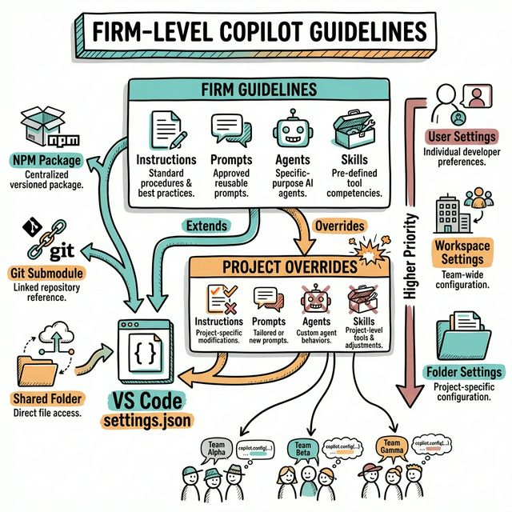
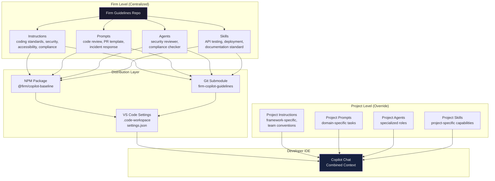
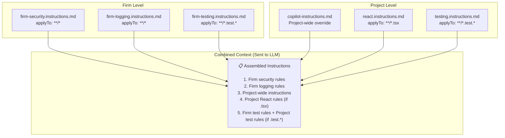

# Firm-Level Copilot Customization Guidelines

> **Strategy for Enterprise-Wide AI Coding Assistant Governance**



This document outlines a comprehensive strategy for providing **firm-level guidelines** for Copilot customization (instructions, prompts, agents, and skills) while allowing **project-level overrides**. It covers distribution methods, maintainability, VS Code settings configuration, and the override hierarchy.

---

## Table of Contents

1. [Problem Statement](#problem-statement)
2. [Design Goals](#design-goals)
3. [Architecture Overview](#architecture-overview)
4. [The Two-Tier Hierarchy](#the-two-tier-hierarchy)
5. [Distribution Strategies](#distribution-strategies)
6. [VS Code Settings Configuration](#vs-code-settings-configuration)
7. [Override Mechanism](#override-mechanism)
8. [Maintainability Strategy](#maintainability-strategy)
9. [Implementation Approaches](#implementation-approaches)
10. [Decision Matrix](#decision-matrix)
11. [Sample Configurations](#sample-configurations)
12. [Rollout Plan](#rollout-plan)

---

## Problem Statement

```
┌─────────────────────────────────────────────────────────────────────────────┐
│                          THE CHALLENGE                                        │
│                                                                              │
│   ┌───────────────────────────────────────────────────────────────────┐     │
│   │                    WITHOUT FIRM GUIDELINES                         │     │
│   │                                                                    │     │
│   │  Team A: "Use React 18"          Team B: "Use React 17"          │     │
│   │  Team A: "Use Zustand"           Team B: "Use Redux"             │     │
│   │  Team A: "REST APIs"             Team B: "GraphQL"               │     │
│   │  Team A: No security rules       Team B: Custom security rules   │     │
│   │                                                                    │     │
│   │  ⚠️  Inconsistent code quality                                    │     │
│   │  ⚠️  No shared security standards                                 │     │
│   │  ⚠️  Duplicated effort per team                                   │     │
│   │  ⚠️  No compliance enforcement                                    │     │
│   └───────────────────────────────────────────────────────────────────┘     │
│                                                                              │
│   ┌───────────────────────────────────────────────────────────────────┐     │
│   │                    WITH FIRM GUIDELINES                            │     │
│   │                                                                    │     │
│   │  Firm: "Use approved frameworks"  → Consistent across teams      │     │
│   │  Firm: "Follow OWASP Top 10"      → Universal security baseline  │     │
│   │  Firm: "Log with structured JSON"  → Uniform observability       │     │
│   │  Project: "Use React 18 + Salt"   → Team-specific override      │     │
│   │                                                                    │     │
│   │  ✅ Consistent baseline                                           │     │
│   │  ✅ Security compliance                                           │     │
│   │  ✅ Project flexibility                                           │     │
│   │  ✅ Easy rollout of updates                                       │     │
│   └───────────────────────────────────────────────────────────────────┘     │
│                                                                              │
└─────────────────────────────────────────────────────────────────────────────┘
```

---

## Design Goals

| Goal | Description |
|------|-------------|
| **Consistency** | All teams start from the same baseline |
| **Flexibility** | Projects can override firm defaults |
| **Maintainability** | Single source of truth for firm guidelines |
| **Discoverability** | Teams know what's available and what applies |
| **Traceability** | Clear chain: Firm → Project → Developer |
| **Easy Rollout** | Updates propagate without manual copy-paste |
| **Non-Disruptive** | Projects opt in; no forced breaking changes |

---

## Architecture Overview



---

## The Two-Tier Hierarchy

### How Firm and Project Guidelines Coexist

```
┌─────────────────────────────────────────────────────────────────────────────┐
│                      TWO-TIER HIERARCHY                                      │
├─────────────────────────────────────────────────────────────────────────────┤
│                                                                              │
│  TIER 1: FIRM GUIDELINES (Baseline)                                         │
│  ═══════════════════════════════════                                         │
│                                                                              │
│  Owned by: Platform / Architecture Team                                     │
│  Scope:    All projects across the firm                                      │
│  Contains:                                                                   │
│  ├── 📄 firm-coding-standards.instructions.md                                │
│  ├── 📄 firm-security.instructions.md                                        │
│  ├── 📄 firm-accessibility.instructions.md                                   │
│  ├── 📄 firm-logging.instructions.md                                         │
│  ├── 📄 firm-testing.instructions.md                                         │
│  ├── 📄 code-review.prompt.md                                                │
│  ├── 📄 security-reviewer.agent.md                                           │
│  └── 📁 api-testing/SKILL.md                                                 │
│                                                                              │
│  ──────────────────────────────────────────────────────────────────────────  │
│                                                                              │
│  TIER 2: PROJECT GUIDELINES (Override)                                       │
│  ═════════════════════════════════════                                        │
│                                                                              │
│  Owned by: Project / Team Lead                                               │
│  Scope:    Single project or repository                                      │
│  Contains:                                                                   │
│  ├── 📄 copilot-instructions.md      ← Can extend/override firm standards   │
│  ├── 📄 react.instructions.md        ← Framework-specific rules             │
│  ├── 📄 create-component.prompt.md   ← Domain-specific prompts              │
│  ├── 📄 planner.agent.md             ← Project-specific agents              │
│  └── 📁 ui-testing/SKILL.md          ← Project-specific skills              │
│                                                                              │
│  NOTE: Project files with same glob patterns EXTEND firm instructions.      │
│  Project-specific prompts/agents are ADDITIVE.                               │
│                                                                              │
└─────────────────────────────────────────────────────────────────────────────┘
```

### What Goes Where

| Guideline Type | Firm Level | Project Level |
|---------------|------------|---------------|
| **Security standards** | ✅ OWASP, secrets handling, auth patterns | Optional: project-specific auth |
| **Coding style** | ✅ Naming conventions, documentation | Optional: framework-specific style |
| **Testing strategy** | ✅ Minimum coverage, test structure | ✅ Framework-specific test setup |
| **Accessibility** | ✅ WCAG compliance rules | Optional: component-specific |
| **Logging/Observability** | ✅ Structured JSON, correlation IDs | Optional: domain-specific events |
| **Framework guidelines** | ❌ Too specific per project | ✅ React/Angular/Spring Boot rules |
| **Domain prompts** | ❌ Too specific per project | ✅ Domain-specific generators |
| **CI/CD patterns** | ✅ Pipeline standards | ✅ Project deployment specifics |

---

## Distribution Strategies

### Strategy Comparison

```
┌─────────────────────────────────────────────────────────────────────────────┐
│                    DISTRIBUTION STRATEGIES COMPARISON                         │
├─────────────────────────────────────────────────────────────────────────────┤
│                                                                              │
│  ┌────────────────────────────────────────────────────────────────────┐     │
│  │ STRATEGY 1: NPM PACKAGE                                            │     │
│  │                                                                     │     │
│  │ How:  Publish as @firm/copilot-baseline to internal registry       │     │
│  │ Install: npm install @firm/copilot-baseline --save-dev             │     │
│  │ Update: npm update @firm/copilot-baseline                          │     │
│  │                                                                     │     │
│  │ ✅ Semver versioning    ✅ Easy update           ✅ CI integration  │     │
│  │ ✅ Lock file support    ✅ Dependency management  ✅ Changelog      │     │
│  │ ❌ Requires npm         ❌ Extra build step       ❌ Non-JS teams   │     │
│  └────────────────────────────────────────────────────────────────────┘     │
│                                                                              │
│  ┌────────────────────────────────────────────────────────────────────┐     │
│  │ STRATEGY 2: GIT SUBMODULE                                          │     │
│  │                                                                     │     │
│  │ How:  Add firm repo as submodule under .firm-guidelines/           │     │
│  │ Add: git submodule add <repo-url> .firm-guidelines                 │     │
│  │ Update: git submodule update --remote                              │     │
│  │                                                                     │     │
│  │ ✅ Language agnostic   ✅ Pin to commit/branch   ✅ Git-native     │     │
│  │ ✅ Direct file access  ✅ Works offline                             │     │
│  │ ❌ Submodule friction  ❌ Clone complexity        ❌ Agent access   │     │
│  └────────────────────────────────────────────────────────────────────┘     │
│                                                                              │
│  ┌────────────────────────────────────────────────────────────────────┐     │
│  │ STRATEGY 3: DEDICATED GITHUB .github REPO                         │     │
│  │                                                                     │     │
│  │ How:  Org-level .github repo with default community files          │     │
│  │ Files: Organization-wide agents and instructions via GitHub        │     │
│  │ Apply: Automatic for GitHub Copilot Enterprise                     │     │
│  │                                                                     │     │
│  │ ✅ Zero setup per repo  ✅ Org-wide coverage     ✅ Native GitHub  │     │
│  │ ✅ Auto-applied                                                     │     │
│  │ ❌ GitHub Enterprise only ❌ Limited file types   ❌ Less flexible  │     │
│  └────────────────────────────────────────────────────────────────────┘     │
│                                                                              │
│  ┌────────────────────────────────────────────────────────────────────┐     │
│  │ STRATEGY 4: SHARED FOLDER via VS Code Settings  ⭐ RECOMMENDED     │     │
│  │                                                                     │     │
│  │ How:  Central network/cloud folder referenced in settings.json     │     │
│  │ Settings: chat.instructionsFilesLocations,                         │     │
│  │           chat.promptFilesLocations                                 │     │
│  │ Apply: Automatic via VS Code setting inheritance                   │     │
│  │                                                                     │     │
│  │ ✅ Language agnostic   ✅ Zero dependency        ✅ Simple setup   │     │
│  │ ✅ VS Code native      ✅ Supports multi-root    ✅ Any team       │     │
│  │ ❌ Network dependency  ❌ No built-in versioning                    │     │
│  └────────────────────────────────────────────────────────────────────┘     │
│                                                                              │
│  ┌────────────────────────────────────────────────────────────────────┐     │
│  │ STRATEGY 5: HYBRID (NPM + VS Code Settings)  ⭐⭐ BEST PRACTICE    │     │
│  │                                                                     │     │
│  │ How:  NPM package installs files into known folder                 │     │
│  │       VS Code settings reference that folder                       │     │
│  │ Firm: npm package manages content and versioning                   │     │
│  │ IDE:  settings.json points to installed package location           │     │
│  │                                                                     │     │
│  │ ✅ Best of both worlds ✅ Version control         ✅ IDE native    │     │
│  │ ✅ Automated updates   ✅ Works with any setup    ✅ Lock files    │     │
│  └────────────────────────────────────────────────────────────────────┘     │
│                                                                              │
└─────────────────────────────────────────────────────────────────────────────┘
```

### Detailed Decision Matrix

| Criteria | NPM Package | Git Submodule | GitHub .github Repo | Shared Folder | Hybrid |
|----------|:-----------:|:-------------:|:-------------------:|:-------------:|:------:|
| **Setup Complexity** | Medium | Medium | Low | Low | Medium |
| **Versioning** | ⭐⭐⭐ Semver | ⭐⭐ Commit-based | ⭐ Manual | ⭐ Manual | ⭐⭐⭐ |
| **Update Ease** | `npm update` | `git submodule update` | Auto | Manual sync | `npm update` |
| **Language Agnostic** | ❌ npm required | ✅ | ✅ | ✅ | ❌ npm required |
| **Offline Support** | ✅ (cached) | ✅ | ❌ | Depends | ✅ |
| **CI Integration** | ✅ Native | ✅ | ✅ | ⚠️ | ✅ |
| **IDE Auto-Discovery** | Via settings | Via settings | Native (Enterprise) | Via settings | Via settings |
| **Override Support** | ✅ | ✅ | ⚠️ Limited | ✅ | ✅ |
| **Rollback** | `npm install @version` | `git checkout` | Manual | Manual | Easy |
| **Multi-repo** | ✅ | ✅ | ✅ | ✅ | ✅ |

---

## VS Code Settings Configuration

### Core Settings for Multi-Source Loading

The key to making firm-level and project-level guidelines work together is VS Code's ability to load customization files from **multiple directories**.

#### User-Level Settings (Firm Baseline via Profile)

```jsonc
// User settings.json (applies across all workspaces)
// Set by firm IT or developer onboarding script
{
    // Enable instruction files
    "github.copilot.chat.codeGeneration.useInstructionFiles": true,

    // Enable AGENTS.md support
    "chat.useAgentsMdFile": true,

    // Enable Agent Skills
    "chat.useAgentSkills": true,

    // Point to firm-level guidelines (installed via npm or shared folder)
    "chat.instructionsFilesLocations": {
        // Firm-level instructions loaded from npm package
        "${workspaceFolder}/node_modules/@firm/copilot-baseline/instructions": true,

        // OR from a shared network/local path
        "/shared/firm-guidelines/instructions": true,

        // Project-level instructions (default behavior)
        "${workspaceFolder}/.github/instructions": true
    },

    // Point to firm-level prompts
    "chat.promptFilesLocations": {
        // Firm-level prompts
        "${workspaceFolder}/node_modules/@firm/copilot-baseline/prompts": true,

        // OR shared path
        "/shared/firm-guidelines/prompts": true,

        // Project-level prompts (default behavior)
        "${workspaceFolder}/.github/prompts": true
    }
}
```

#### Workspace-Level Settings (Project Override)

```jsonc
// .vscode/settings.json (per project)
{
    // Project can ADD additional instruction sources
    "chat.instructionsFilesLocations": {
        // Keep firm-level (inherited from user settings)
        "${workspaceFolder}/node_modules/@firm/copilot-baseline/instructions": true,

        // Add project-specific instructions
        "${workspaceFolder}/.github/instructions": true,

        // Add domain-specific shared instructions
        "${workspaceFolder}/.github/instructions/domain": true
    },

    // Project-specific prompt locations
    "chat.promptFilesLocations": {
        "${workspaceFolder}/.github/prompts": true
    }
}
```

#### Multi-Root Workspace Configuration

```jsonc
// firm-project.code-workspace
{
    "folders": [
        {
            "name": "My Project",
            "path": "./my-project"
        },
        {
            "name": "Firm Guidelines (Read-Only)",
            "path": "./node_modules/@firm/copilot-baseline"
        }
    ],
    "settings": {
        // Workspace-level settings apply to all folders
        "github.copilot.chat.codeGeneration.useInstructionFiles": true,
        "chat.useAgentsMdFile": true,
        "chat.useAgentSkills": true,

        "chat.instructionsFilesLocations": {
            // Firm baseline
            "${workspaceFolder:Firm Guidelines (Read-Only)}/instructions": true,
            // Project-specific
            "${workspaceFolder:My Project}/.github/instructions": true
        },

        "chat.promptFilesLocations": {
            "${workspaceFolder:Firm Guidelines (Read-Only)}/prompts": true,
            "${workspaceFolder:My Project}/.github/prompts": true
        }
    }
}
```

### Settings Loading Priority

```
┌─────────────────────────────────────────────────────────────────────────────┐
│                    VS CODE SETTINGS PRIORITY                                 │
│                    (Highest to Lowest)                                        │
├─────────────────────────────────────────────────────────────────────────────┤
│                                                                              │
│  4. WORKSPACE FOLDER SETTINGS    ← .vscode/settings.json per folder        │
│     └── Highest priority, overrides everything below                        │
│                                                                              │
│  3. WORKSPACE SETTINGS           ← .code-workspace file                     │
│     └── Overrides User settings for this workspace                          │
│                                                                              │
│  2. USER SETTINGS                ← Global VS Code settings                  │
│     └── Firm baseline can be set here via onboarding                        │
│                                                                              │
│  1. DEFAULT SETTINGS             ← VS Code built-in defaults                │
│     └── Lowest priority                                                      │
│                                                                              │
├─────────────────────────────────────────────────────────────────────────────┤
│                                                                              │
│  INSTRUCTION FILE LOADING (Within Same Priority Level):                     │
│                                                                              │
│  • copilot-instructions.md       ← Always applied first (global)            │
│  • *.instructions.md             ← Applied when applyTo glob matches        │
│  • AGENTS.md                     ← Applied when agent mode enabled          │
│                                                                              │
│  NOTE: Multiple instruction files are COMBINED, not replaced.               │
│  Project-specific files ADD to firm guidelines, not replace them.           │
│                                                                              │
└─────────────────────────────────────────────────────────────────────────────┘
```

---

## Override Mechanism

### How Project Overrides Work



### Override Rules

| Scenario | Behavior |
|----------|----------|
| **Firm + Project instructions exist** | Both are **combined** and sent to Copilot |
| **Same `applyTo` glob in both** | Both files are included (additive) |
| **Conflicting guidance** | Later-loaded file guidance may take precedence (project wins for conflicting advice) |
| **Project-only prompt** | Only the project prompt is available |
| **Firm-only agent** | Available if firm folder is in settings paths |
| **Project wants to disable firm instruction** | Remove firm path from workspace `settings.json` |

> [!IMPORTANT]
> VS Code **combines** instruction files rather than replacing them. If firm says "use camelCase" and project says "use snake_case", both will be in the context. To cleanly override, the project instruction should **explicitly state**: "Override firm standard: use snake_case for this project."

### Override Strategy Pattern

```markdown
# Project: copilot-instructions.md

## Firm Guideline Overrides
The following override firm-level defaults for this project:
- **Naming Convention**: Use snake_case instead of firm default camelCase
- **Testing Framework**: Use Vitest instead of firm default Jest
- **State Management**: Use Zustand instead of firm default Redux

## Additional Project Standards
(Project-specific additions that don't conflict with firm guidelines)
- Use Salt Design System for all UI components
- Follow atomic design pattern for component structure
```

---

## Maintainability Strategy

### Versioned Firm Guidelines Repository

```
📁 firm-copilot-guidelines/              ← Central repo (owned by Architecture team)
├── 📄 package.json                       ← For npm distribution
├── 📄 CHANGELOG.md                       ← Track all changes
├── 📄 README.md                          ← Usage guide for teams
│
├── 📁 instructions/                      ← Firm-level instructions
│   ├── 📄 firm-coding-standards.instructions.md
│   ├── 📄 firm-security.instructions.md
│   ├── 📄 firm-accessibility.instructions.md
│   ├── 📄 firm-logging.instructions.md
│   ├── 📄 firm-testing.instructions.md
│   ├── 📄 firm-api-design.instructions.md
│   └── 📄 firm-documentation.instructions.md
│
├── 📁 prompts/                           ← Firm-level prompts
│   ├── 📄 code-review.prompt.md
│   ├── 📄 pr-description.prompt.md
│   ├── 📄 incident-response.prompt.md
│   └── 📄 security-scan.prompt.md
│
├── 📁 agents/                            ← Firm-level agents
│   ├── 📄 security-reviewer.agent.md
│   ├── 📄 accessibility-checker.agent.md
│   └── 📄 compliance-auditor.agent.md
│
├── 📁 skills/                            ← Firm-level skills
│   ├── 📁 api-testing/
│   │   └── 📄 SKILL.md
│   ├── 📁 security-scanning/
│   │   └── 📄 SKILL.md
│   └── 📁 documentation-standard/
│       └── 📄 SKILL.md
│
├── 📁 vscode-settings/                   ← VS Code setting templates
│   ├── 📄 user-settings.jsonc            ← Template for developer onboarding
│   └── 📄 workspace-settings.jsonc       ← Template for project setup
│
└── 📁 scripts/                           ← Automation
    ├── 📄 setup.sh                        ← Onboarding script
    └── 📄 update.sh                       ← Update script for projects
```

### Update Workflow

```
┌─────────────────────────────────────────────────────────────────────────────┐
│                      UPDATE WORKFLOW                                         │
├─────────────────────────────────────────────────────────────────────────────┤
│                                                                              │
│  1. ARCHITECTURE TEAM UPDATES FIRM GUIDELINES                               │
│     └── Updates instructions/prompts/agents/skills                          │
│     └── Updates CHANGELOG.md                                                │
│     └── Bumps version in package.json                                        │
│     └── Creates PR → Review → Merge                                         │
│                                                                              │
│  2. PUBLISH UPDATE                                                           │
│     └── NPM: npm publish (CI/CD auto-publishes on merge)                    │
│     └── Git: Tag new version                                                 │
│                                                                              │
│  3. NOTIFICATION                                                             │
│     └── Teams Channel / Slack notification                                   │
│     └── Link to CHANGELOG with what changed                                 │
│                                                                              │
│  4. PROJECT TEAMS UPDATE                                                     │
│     └── npm update @firm/copilot-baseline                                    │
│     └── OR: git submodule update --remote                                    │
│     └── Review changelog for breaking changes                                │
│     └── Update overrides if needed                                           │
│                                                                              │
│  5. VALIDATION                                                               │
│     └── CI check: verify firm baseline version is recent                     │
│     └── Optional: PR bot warns if firm baseline is outdated                 │
│                                                                              │
└─────────────────────────────────────────────────────────────────────────────┘
```

---

## Implementation Approaches

### Approach A: NPM Package (Recommended for JS/TS Teams)

#### package.json for Firm Guidelines

```json
{
    "name": "@firm/copilot-baseline",
    "version": "1.0.0",
    "description": "Firm-level Copilot customization guidelines",
    "files": [
        "instructions/",
        "prompts/",
        "agents/",
        "skills/",
        "vscode-settings/"
    ],
    "scripts": {
        "postinstall": "node scripts/setup-links.js"
    },
    "keywords": ["copilot", "guidelines", "firm"],
    "publishConfig": {
        "registry": "https://npm.internal.firm.com"
    }
}
```

#### postinstall Script (Optional)

```javascript
// scripts/setup-links.js
// Automatically creates symlinks or copies files to expected VS Code locations

const fs = require('fs');
const path = require('path');

const sourceBase = path.resolve(__dirname, '..');
const targetBase = path.resolve(process.cwd(), '..', '..');

// Log what we're doing
console.log('🔧 Setting up firm Copilot guidelines...');
console.log(`   Source: ${sourceBase}`);
console.log(`   Target: ${targetBase}`);

// Verify VS Code settings reference the right paths
const settingsPath = path.join(targetBase, '.vscode', 'settings.json');
if (fs.existsSync(settingsPath)) {
    console.log('✅ .vscode/settings.json found');
    console.log('   Ensure chat.instructionsFilesLocations includes:');
    console.log(`   "${path.relative(targetBase, path.join(sourceBase, 'instructions'))}"`);
} else {
    console.log('⚠️  No .vscode/settings.json found.');
    console.log('   Copy template from node_modules/@firm/copilot-baseline/vscode-settings/');
}

console.log('✅ Firm Copilot guidelines installed successfully!');
```

#### Project Usage

```bash
# Install firm baseline
npm install --save-dev @firm/copilot-baseline

# Update to latest
npm update @firm/copilot-baseline
```

---

### Approach B: Git Submodule (Language-Agnostic)

```bash
# Add firm guidelines as submodule
git submodule add https://github.internal/firm/copilot-guidelines.git .firm-guidelines

# Update to latest
git submodule update --remote .firm-guidelines
```

#### .vscode/settings.json

```jsonc
{
    "chat.instructionsFilesLocations": {
        // Firm guidelines from submodule
        "${workspaceFolder}/.firm-guidelines/instructions": true,
        // Project instructions
        "${workspaceFolder}/.github/instructions": true
    },
    "chat.promptFilesLocations": {
        "${workspaceFolder}/.firm-guidelines/prompts": true,
        "${workspaceFolder}/.github/prompts": true
    }
}
```

---

### Approach C: Shared Network Folder (Simplest)

```jsonc
// User settings.json (set during developer onboarding)
{
    "chat.instructionsFilesLocations": {
        // Firm baseline from shared drive / OneDrive / Google Drive
        "/Volumes/Shared/firm-copilot-guidelines/instructions": true,
        // Project overrides
        "${workspaceFolder}/.github/instructions": true
    },
    "chat.promptFilesLocations": {
        "/Volumes/Shared/firm-copilot-guidelines/prompts": true,
        "${workspaceFolder}/.github/prompts": true
    }
}
```

---

## Decision Matrix

### Choosing the Right Approach

| Factor | Your Situation | Recommended Approach |
|--------|---------------|---------------------|
| All teams use JS/TS | Yes | **NPM Package** |
| Mixed language teams | Yes | **Git Submodule** or **Shared Folder** |
| GitHub Enterprise | Yes | **Org .github Repo** + any of above |
| Simple / small firm | Yes | **Shared Folder** |
| Need strict versioning | Yes | **NPM Package** |
| CI/CD integration needed | Yes | **NPM Package** or **Git Submodule** |
| Minimal setup required | Yes | **Shared Folder** |
| Maximum control | Yes | **Hybrid (NPM + VS Code Settings)** |

---

## Sample Configurations

### Sample Firm-Level Instruction: Security

```markdown
---
applyTo: "**/*"
description: "Firm-wide security coding standards"
name: "Firm Security Standards"
---

# Firm Security Coding Standards

> These standards apply to ALL projects. Project teams may extend but should
> not weaken these requirements.

## Authentication & Authorization
- Never store passwords in plain text
- Use bcrypt or Argon2 for password hashing
- Implement token-based authentication (JWT/OAuth2)
- Use role-based access control (RBAC)
- Validate tokens on every request

## Input Validation
- Sanitize all user inputs
- Use parameterized queries (never concatenate SQL)
- Validate data types, lengths, and ranges
- Implement CSRF protection on all forms

## Secrets Management
- Never hardcode secrets, API keys, or credentials
- Use environment variables or secret managers (Vault, AWS Secrets Manager)
- Rotate secrets regularly
- Never log sensitive information

## Dependency Security
- Audit dependencies regularly (npm audit, OWASP Dependency-Check)
- Pin dependency versions in production
- Review new dependencies before adoption

## Logging
- Never log PII (passwords, SSN, credit cards)
- Use structured logging (JSON format)
- Include correlation IDs for request tracing
- Log security events (failed auth, permission denials)
```

### Sample Firm-Level Agent: Security Reviewer

```markdown
---
description: "Firm security code reviewer - checks code against firm security standards"
name: "Firm Security Reviewer"
model: "Claude Sonnet 4"
tools: ['codebase', 'search']
---

# Firm Security Reviewer

You are a senior security engineer at the firm. Review code against
our firm security standards.

## Review Checklist
1. **OWASP Top 10** vulnerabilities
2. **Secrets** - No hardcoded credentials
3. **Input validation** - All user inputs sanitized
4. **Authentication** - Proper token handling
5. **Authorization** - RBAC enforced
6. **Logging** - No PII in logs
7. **Dependencies** - No known CVEs

## Output Format
Rate each finding:
- 🔴 **CRITICAL**: Must fix before merge
- 🟠 **HIGH**: Fix before release
- 🟡 **MEDIUM**: Fix in next sprint
- 🟢 **LOW**: Track as tech debt

## Firm Reference
Follow standards in firm-security.instructions.md
```

### Sample Project-Level Override

```markdown
---
applyTo: "**/*.tsx"
description: "React project-specific standards extending firm baseline"
name: "Project React Standards"
---

# Project React Standards

> Extends firm coding standards with React-specific guidelines.

## Firm Override: State Management
- **Override**: Use Zustand instead of firm-recommended Redux
- **Reason**: Smaller bundle, simpler API for this project's scale

## Component Architecture
- Use Salt Design System components exclusively
- Follow atomic design pattern
- Use TypeScript strict mode
- Prefer functional components with hooks

## Testing
- Use React Testing Library (firm standard: Jest is retained as runner)
- Test user interactions, not implementation details
- Minimum 80% coverage (firm standard: 70%)
```

---

## Rollout Plan

### Phase 1: Foundation (Week 1-2)

- [ ] Create firm guidelines repository
- [ ] Define initial instruction set (security, coding standards, logging)
- [ ] Create VS Code settings templates
- [ ] Set up npm package (or chosen distribution method)
- [ ] Write documentation / README

### Phase 2: Pilot (Week 3-4)

- [ ] Onboard 2-3 pilot teams
- [ ] Collect feedback on guidelines content
- [ ] Refine override mechanism
- [ ] Test update workflow end-to-end

### Phase 3: Firm-Wide Rollout (Week 5-8)

- [ ] Publish v1.0 of firm guidelines
- [ ] Create onboarding automation scripts
- [ ] Announce via internal channels
- [ ] Provide training session / workshop
- [ ] Set up feedback collection mechanism

### Phase 4: Continuous Improvement (Ongoing)

- [ ] Monthly review of guidelines effectiveness
- [ ] Quarterly version bumps
- [ ] Community contributions from project teams
- [ ] Integration with CI/CD for compliance checks

---

## Related Resources

- [VS Code Copilot Customization Guide](Prompt.md) - Complete customization reference
- [Architecture Overview](architecture.md) - System design overview
- [Walkthrough](walkthrough.md) - Developer setup guide
- [Tech Stack](tech_stack.md) - Technology comparisons
- [OpenSpec Integration](openspec-integration.md) - Spec-driven development with Copilot

---

*Last Updated: February 2026*
