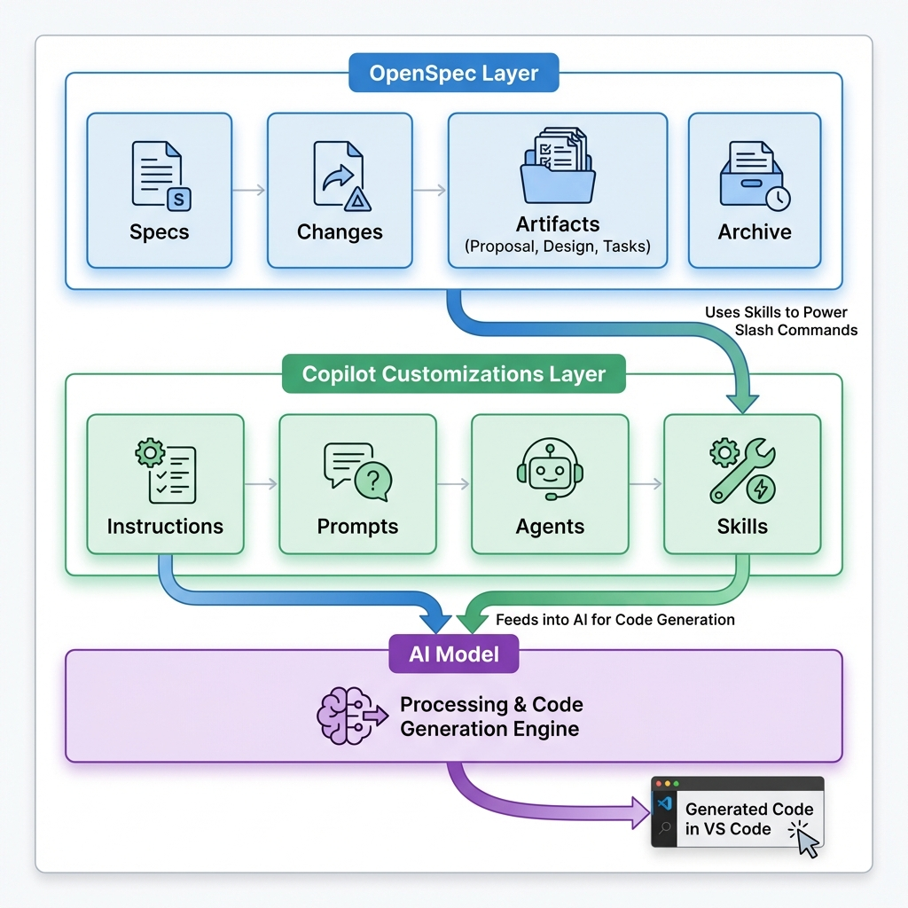
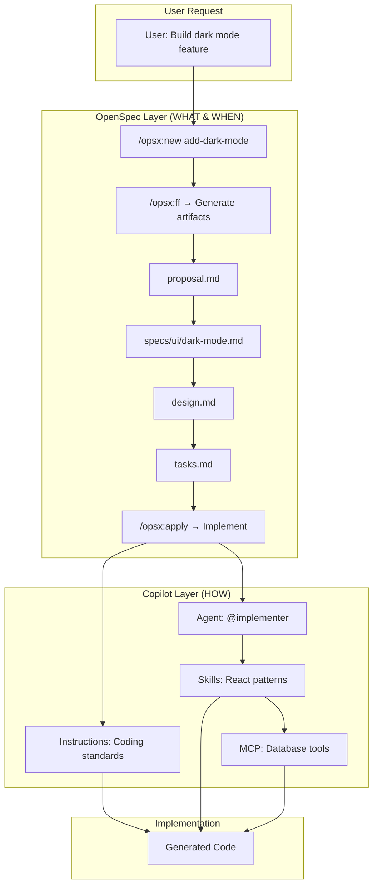

# OpenSpec Integration with VS Code Copilot Customizations

> **Spec-Driven Development (SDD) for AI Coding Assistants**



This document provides a comprehensive guide to [OpenSpec](https://github.com/Fission-AI/OpenSpec) - an open-source framework for spec-driven development with AI coding assistants - and explains how it integrates with VS Code Copilot customization features like Agents, Prompts, Instructions, and Skills.

---

## Table of Contents

1. [What is OpenSpec?](#what-is-openspec)
2. [Core Philosophy](#core-philosophy)
3. [How OpenSpec Works](#how-openspec-works)
4. [Integration with Copilot Customizations](#integration-with-copilot-customizations)
5. [Side-by-Side Comparison](#side-by-side-comparison)
6. [Synergy Map](#synergy-map)
7. [Implementation Strategy](#implementation-strategy)
8. [Workflow Examples](#workflow-examples)
9. [Best Practices](#best-practices)
10. [Quick Start Guide](#quick-start-guide)

---

## What is OpenSpec?

OpenSpec is a **Spec-Driven Development (SDD)** framework designed to add structure and predictability to AI-assisted coding. It creates a lightweight specification layer that ensures human and AI agree on **what to build** before any code is written.

### The Problem OpenSpec Solves

```
┌─────────────────────────────────────────────────────────────────────────────┐
│                          WITHOUT OPENSPEC                                    │
│                                                                              │
│   User ────► "Add dark mode" ────► AI generates code ────► ???              │
│                                                                              │
│   Problems:                                                                  │
│   • Requirements live only in chat history                                  │
│   • No shared understanding of scope                                        │
│   • Unpredictable results                                                   │
│   • Difficult to track what was implemented                                 │
└─────────────────────────────────────────────────────────────────────────────┘

┌─────────────────────────────────────────────────────────────────────────────┐
│                           WITH OPENSPEC                                      │
│                                                                              │
│   User ────► Proposal ────► Specs ────► Design ────► Tasks ────► Apply     │
│                                                                              │
│   Benefits:                                                                  │
│   • Agree on requirements before coding                                     │
│   • Organized change folders                                                │
│   • Traceable artifacts                                                     │
│   • Predictable, reviewable workflow                                        │
└─────────────────────────────────────────────────────────────────────────────┘
```

### Key Features

| Feature | Description |
|---------|-------------|
| **Multi-Tool Support** | Works with 20+ AI coding assistants including Copilot, Claude, Cursor, etc. |
| **Artifact-Based Flow** | Proposal → Specs → Design → Tasks → Implementation |
| **Delta Specs** | Changes are tracked as deltas, not full rewrites |
| **Schema Customization** | Define your own workflow and artifact templates |
| **Slash Commands** | Simple commands like `/opsx:new`, `/opsx:apply` |

---

## Core Philosophy

OpenSpec is built around four principles:

```
┌─────────────────────────────────────────────────────────────────────────────┐
│                         OPENSPEC PHILOSOPHY                                  │
│                                                                              │
│   ┌───────────────────┐   ┌───────────────────┐                             │
│   │   FLUID           │   │   ITERATIVE       │                             │
│   │   not rigid       │   │   not waterfall   │                             │
│   │                   │   │                   │                             │
│   │ No phase gates,   │   │ Learn as you      │                             │
│   │ work on what      │   │ build, refine     │                             │
│   │ makes sense       │   │ as you go         │                             │
│   └───────────────────┘   └───────────────────┘                             │
│                                                                              │
│   ┌───────────────────┐   ┌───────────────────┐                             │
│   │   EASY            │   │   BROWNFIELD      │                             │
│   │   not complex     │   │   FIRST           │                             │
│   │                   │   │                   │                             │
│   │ Lightweight       │   │ Works with        │                             │
│   │ setup, minimal    │   │ existing code,    │                             │
│   │ ceremony          │   │ not just new      │                             │
│   └───────────────────┘   └───────────────────┘                             │
│                                                                              │
└─────────────────────────────────────────────────────────────────────────────┘
```

---

## How OpenSpec Works

### Directory Structure

```
📁 project-root/
├── 📁 openspec/
│   ├── 📄 config.yaml              ← Project configuration
│   │
│   ├── 📁 specs/                   ← Source of truth (current behavior)
│   │   ├── 📁 auth/
│   │   │   └── 📄 spec.md
│   │   └── 📁 ui/
│   │       └── 📄 spec.md
│   │
│   ├── 📁 changes/                 ← In-progress changes (one folder each)
│   │   ├── 📁 add-dark-mode/
│   │   │   ├── 📄 .openspec.yaml   ← Change metadata
│   │   │   ├── 📄 proposal.md      ← WHY: Intent and scope
│   │   │   ├── 📁 specs/           ← WHAT: Delta specs
│   │   │   ├── 📄 design.md        ← HOW: Technical approach
│   │   │   └── 📄 tasks.md         ← STEPS: Implementation checklist
│   │   └── 📁 fix-login-bug/
│   │       └── ...
│   │
│   ├── 📁 archive/                 ← Completed changes (historical record)
│   │   └── 📁 2025-01-27-initial-setup/
│   │
│   └── 📁 schemas/                 ← Custom workflow schemas (optional)
│       └── 📁 my-workflow/
│           ├── 📄 schema.yaml
│           └── 📁 templates/
│
├── 📁 .github/                     ← Standard Copilot customizations
│   ├── 📄 copilot-instructions.md
│   ├── 📁 prompts/
│   ├── 📁 agents/
│   └── 📁 skills/
│       └── 📁 openspec-*/          ← OpenSpec skills installed here
│
└── 📄 src/                         ← Your actual code
```

### The Artifact Flow

```
┌─────────────────────────────────────────────────────────────────────────────┐
│                           ARTIFACT FLOW                                      │
│                                                                              │
│   proposal ──────► specs ──────► design ──────► tasks ──────► implement    │
│       │               │             │              │                         │
│      WHY            WHAT           HOW          STEPS                        │
│   + scope        changes       approach      to take                         │
│                                                                              │
│   Each artifact provides context for the next                               │
└─────────────────────────────────────────────────────────────────────────────┘
```

### Slash Commands

| Command | Purpose |
|---------|---------|
| `/opsx:explore` | Think through ideas before committing to a change |
| `/opsx:new <name>` | Start a new change folder |
| `/opsx:continue` | Create the next artifact based on dependencies |
| `/opsx:ff` | Fast-forward: create all planning artifacts at once |
| `/opsx:apply` | Implement tasks from the change |
| `/opsx:verify` | Validate implementation matches artifacts |
| `/opsx:sync` | Merge delta specs into main specs |
| `/opsx:archive` | Archive a completed change |
| `/opsx:onboard` | Guided tutorial through the workflow |

---

## Integration with Copilot Customizations

OpenSpec is designed to work **alongside** VS Code Copilot customizations, not replace them. Each serves a different purpose:

```
┌─────────────────────────────────────────────────────────────────────────────┐
│                    OPENSPEC + COPILOT CUSTOMIZATIONS                         │
│                                                                              │
│   ┌────────────────────────────────────────────────────────────────────┐    │
│   │                        OPENSPEC                                     │    │
│   │                                                                     │    │
│   │  WORKFLOW ORCHESTRATION                                            │    │
│   │  • What to build (Specs)                                           │    │
│   │  • When to build (Task ordering)                                   │    │
│   │  • How to track progress (Artifacts)                               │    │
│   │  • Change management (Archive, Delta specs)                        │    │
│   └────────────────────────────────────────────────────────────────────┘    │
│                              ▲                                               │
│                              │ Works with                                    │
│                              ▼                                               │
│   ┌────────────────────────────────────────────────────────────────────┐    │
│   │                   COPILOT CUSTOMIZATIONS                            │    │
│   │                                                                     │    │
│   │  ┌──────────────┐ ┌──────────────┐ ┌──────────────┐ ┌───────────┐ │    │
│   │  │ INSTRUCTIONS │ │   PROMPTS    │ │    AGENTS    │ │  SKILLS   │ │    │
│   │  │              │ │              │ │              │ │           │ │    │
│   │  │ Coding       │ │ Reusable     │ │ Specialized  │ │ Portable  │ │    │
│   │  │ standards &  │ │ task         │ │ AI personas  │ │ cross-tool│ │    │
│   │  │ guidelines   │ │ templates    │ │ for roles    │ │ abilities │ │    │
│   │  └──────────────┘ └──────────────┘ └──────────────┘ └───────────┘ │    │
│   └────────────────────────────────────────────────────────────────────┘    │
│                                                                              │
└─────────────────────────────────────────────────────────────────────────────┘
```

### OpenSpec Uses Copilot Skills

When you run `openspec init`, it installs **Skills** into your Copilot configuration:

| OpenSpec Skill | Copilot Location | Purpose |
|----------------|------------------|---------|
| `openspec-new-change` | `.github/skills/` | Powers `/opsx:new` command |
| `openspec-continue-change` | `.github/skills/` | Powers `/opsx:continue` command |
| `openspec-ff-change` | `.github/skills/` | Powers `/opsx:ff` command |
| `openspec-apply-change` | `.github/skills/` | Powers `/opsx:apply` command |
| `openspec-verify-change` | `.github/skills/` | Powers `/opsx:verify` command |
| `openspec-archive-change` | `.github/skills/` | Powers `/opsx:archive` command |
| `openspec-explore` | `.github/skills/` | Powers `/opsx:explore` command |
| `openspec-sync-specs` | `.github/skills/` | Powers `/opsx:sync` command |
| `openspec-bulk-archive-change` | `.github/skills/` | Powers `/opsx:bulk-archive` |
| `openspec-onboard` | `.github/skills/` | Powers `/opsx:onboard` command |

---

## Side-by-Side Comparison

### Feature Mapping

| Aspect | Copilot Customizations | OpenSpec | Synergy |
|--------|----------------------|----------|---------|
| **Purpose** | AI behavior & capabilities | Workflow & specifications | Complementary |
| **Scope** | Per-request context | Per-change lifecycle | Different levels |
| **Persistence** | Files in workspace | Specs + change folders | Both persist |
| **Team Sharing** | Via Git | Via Git | Same mechanism |
| **AI Guidance** | Instructions, Prompts | Proposals, Designs | Different domains |

### Detailed Comparison

```
┌─────────────────────────────────────────────────────────────────────────────┐
│                        FEATURE COMPARISON                                    │
├─────────────────────────────────────────────────────────────────────────────┤
│                                                                              │
│   COPILOT INSTRUCTIONS              │   OPENSPEC CONFIG                     │
│   ─────────────────────             │   ─────────────────                   │
│   • HOW to write code               │   • WHAT is the tech stack           │
│   • Coding standards                │   • Project-level context             │
│   • Style preferences               │   • Schema defaults                   │
│                                     │                                       │
│   Example:                          │   Example:                            │
│   "Use TypeScript strict mode"      │   "Tech stack: React, Node, Postgres" │
│                                     │                                       │
├─────────────────────────────────────┴───────────────────────────────────────┤
│                                                                              │
│   COPILOT PROMPTS                   │   OPENSPEC ARTIFACTS                  │
│   ─────────────────                 │   ────────────────────                │
│   • Reusable task templates         │   • Change-specific documents         │
│   • On-demand invocation            │   • Sequential artifact flow          │
│   • Variables for inputs            │   • Dependency-driven creation        │
│                                     │                                       │
│   Example:                          │   Example:                            │
│   `/create-api ${input:name}`       │   proposal.md → specs/ → design.md   │
│                                     │                                       │
├─────────────────────────────────────┴───────────────────────────────────────┤
│                                                                              │
│   COPILOT AGENTS                    │   OPENSPEC SCHEMAS                    │
│   ──────────────                    │   ────────────────                    │
│   • Specialized AI personas         │   • Workflow definitions              │
│   • Tool restrictions               │   • Artifact dependencies             │
│   • Role-based behavior             │   • Template customization            │
│                                     │                                       │
│   Example:                          │   Example:                            │
│   @security-reviewer agent          │   spec-driven schema                  │
│                                     │                                       │
├─────────────────────────────────────┴───────────────────────────────────────┤
│                                                                              │
│   COPILOT SKILLS                    │   OPENSPEC COMMANDS                   │
│   ──────────────                    │   ───────────────────                 │
│   • Portable capabilities           │   • Workflow actions                  │
│   • Any AI tool can use             │   • Built on top of Skills            │
│   • Progressive loading             │   • Cross-tool compatible             │
│                                     │                                       │
│   OpenSpec USES Skills to power its slash commands!                        │
│                                     │                                       │
└─────────────────────────────────────────────────────────────────────────────┘
```

---

## Synergy Map

### How They Work Together



### Integration Points

| Integration Point | OpenSpec Role | Copilot Role |
|------------------|---------------|--------------|
| **Change Start** | Creates change folder | Instructions guide initial scope |
| **Planning** | Generates artifacts | Prompts can feed into proposals |
| **Design** | Captures architecture | Agents suggest patterns |
| **Implementation** | Tracks tasks | Skills provide implementation guidance |
| **Verification** | Validates completion | MCP tools run tests |

---

## Implementation Strategy

### Strategy 1: OpenSpec as Primary Workflow

Use OpenSpec to orchestrate the entire development lifecycle, with Copilot customizations supporting each phase.

```
┌─────────────────────────────────────────────────────────────────────────────┐
│                   STRATEGY 1: OPENSPEC-FIRST                                 │
│                                                                              │
│   📋 OPENSPEC ORCHESTRATES                                                   │
│   ─────────────────────────                                                  │
│                                                                              │
│   ┌─────────┐   ┌─────────┐   ┌─────────┐   ┌─────────┐   ┌─────────┐      │
│   │  NEW    │──►│   FF    │──►│  APPLY  │──►│ VERIFY  │──►│ ARCHIVE │      │
│   │ Change  │   │Artifacts│   │  Tasks  │   │ Quality │   │ History │      │
│   └────┬────┘   └────┬────┘   └────┬────┘   └────┬────┘   └────┬────┘      │
│        │             │             │             │             │            │
│        ▼             ▼             ▼             ▼             ▼            │
│   ┌─────────────────────────────────────────────────────────────────────┐  │
│   │                    COPILOT SUPPORTS EACH PHASE                       │  │
│   │                                                                      │  │
│   │  Instructions  │  Instructions  │  Agents,    │  MCP Tools  │  N/A  │  │
│   │  for scope     │  for design    │  Skills     │  for tests  │       │  │
│   │  definition    │  patterns      │  for code   │             │       │  │
│   └─────────────────────────────────────────────────────────────────────┘  │
│                                                                              │
└─────────────────────────────────────────────────────────────────────────────┘
```

### Strategy 2: Selective OpenSpec Usage

Use OpenSpec for complex features, use direct Copilot for simple tasks.

```
┌─────────────────────────────────────────────────────────────────────────────┐
│                   STRATEGY 2: SELECTIVE USAGE                                │
│                                                                              │
│   ┌──────────────────────────────┐   ┌──────────────────────────────────┐  │
│   │        COMPLEX FEATURES       │   │         SIMPLE TASKS            │  │
│   │        (Use OpenSpec)         │   │         (Direct Copilot)        │  │
│   │                               │   │                                  │  │
│   │  • New modules                │   │  • Bug fixes                     │  │
│   │  • Architecture changes       │   │  • Documentation                 │  │
│   │  • Cross-team features        │   │  • Refactoring                   │  │
│   │  • Breaking changes           │   │  • Style updates                 │  │
│   │                               │   │                                  │  │
│   │  /opsx:new → /opsx:ff →      │   │  Chat directly with Copilot     │  │
│   │  /opsx:apply → /opsx:archive  │   │  using instructions & prompts    │  │
│   └──────────────────────────────┘   └──────────────────────────────────┘  │
│                                                                              │
└─────────────────────────────────────────────────────────────────────────────┘
```

### Strategy 3: Custom Agents for OpenSpec Phases

Create Copilot agents aligned with OpenSpec phases.

```markdown
# File: .github/agents/spec-author.agent.md
---
name: Spec Author
description: Creates OpenSpec artifacts following best practices
model: Claude Sonnet 4
tools: ['codebase', 'search']
---

You are a specification author. Your role is to:
1. Create clear, actionable proposals
2. Write detailed specs using Given/When/Then format
3. Design technical approaches with tradeoffs
4. Break work into atomic, testable tasks

When writing specs, reference existing patterns in the codebase.
Always consider backward compatibility implications.
```

---

## Workflow Examples

### Example 1: Complete Feature Development

```
┌─────────────────────────────────────────────────────────────────────────────┐
│                    FEATURE: ADD USER AUTHENTICATION                          │
└─────────────────────────────────────────────────────────────────────────────┘

STEP 1: Start the Change
─────────────────────────
You: /opsx:new add-user-authentication

AI:  Created openspec/changes/add-user-authentication/
     Schema: spec-driven
     Ready to create: proposal

STEP 2: Fast-Forward Through Planning
─────────────────────────────────────
You: /opsx:ff

AI:  Creating all planning artifacts...

     ✓ proposal.md — Intent: Add secure user authentication using JWT
     ✓ specs/auth/spec.md — Requirements and scenarios
     ✓ design.md — Technical approach with session management
     ✓ tasks.md — 12 implementation tasks

     Ready for implementation!

STEP 3: Implement with Copilot
──────────────────────────────
You: /opsx:apply

AI:  Working through tasks...
     
     [Copilot uses your Instructions for coding standards]
     [Copilot loads your Skills for React patterns]
     [Copilot uses MCP server for database operations]
     
     ✓ 1.1 Create User model
     ✓ 1.2 Set up JWT configuration
     ✓ 2.1 Create login endpoint
     ...
     All tasks complete!

STEP 4: Archive and Update Specs
────────────────────────────────
You: /opsx:archive

AI:  ✓ Merged delta specs into openspec/specs/
     ✓ Archived to openspec/archive/2025-01-27-add-user-authentication/
     Specs are now the updated source of truth.
```

### Example 2: Using Custom Agent with OpenSpec

```
┌─────────────────────────────────────────────────────────────────────────────┐
│                    USING @PLANNER AGENT WITH OPENSPEC                        │
└─────────────────────────────────────────────────────────────────────────────┘

You: @planner /opsx:new refactor-payment-module

AI:  [Planner Agent activated - read-only tools]
     
     Created openspec/changes/refactor-payment-module/
     
     Before proceeding, I've analyzed the existing payment module:
     
     📊 Current State:
     - PaymentService.java: 450 lines, high complexity
     - 3 payment providers tightly coupled
     - No interface abstraction
     
     📋 Suggested Scope:
     1. Extract PaymentProvider interface
     2. Create adapter for each provider
     3. Add factory pattern for provider selection
     
     Ready to create: proposal
     Use /opsx:continue or /opsx:ff to proceed.

You: /opsx:ff

AI:  [Still using Planner Agent for read-only analysis]
     
     ✓ proposal.md — Refactoring rationale with risk assessment
     ✓ specs/payments/spec.md — New interface contracts
     ✓ design.md — Adapter pattern implementation
     ✓ tasks.md — Safe refactoring steps with rollback points

You: @implementer /opsx:apply

AI:  [Switching to Implementer Agent - full edit capabilities]
     
     Working through tasks with edit permissions...
```

---

## Best Practices

### 1. Configuration Alignment

Align your OpenSpec config with Copilot instructions:

```yaml
# openspec/config.yaml
schema: spec-driven

context: |
  Tech stack: TypeScript, React, Node.js, PostgreSQL
  API style: RESTful with OpenAPI 3.0
  Testing: Jest + React Testing Library
  
  See .github/copilot-instructions.md for coding standards.

rules:
  proposal:
    - Reference @planner agent for initial analysis
    - Include rollback strategy
  specs:
    - Use Given/When/Then format per testing.instructions.md
  tasks:
    - Map to single @implementer session each
```

### 2. Skill Organization

Organize skills to complement OpenSpec:

```
📁 .github/skills/
├── 📁 openspec-new-change/          ← OpenSpec skill
├── 📁 openspec-apply-change/        ← OpenSpec skill
│
├── 📁 react-patterns/               ← Your custom skill
│   ├── SKILL.md
│   └── examples/
│
└── 📁 api-design/                   ← Your custom skill
    ├── SKILL.md
    └── openapi-template.yaml
```

### 3. Agent-Phase Mapping

Map agents to OpenSpec phases:

| OpenSpec Phase | Recommended Agent | Tools |
|----------------|-------------------|-------|
| `/opsx:explore` | @analyst | `codebase`, `search` |
| `/opsx:new`, `/opsx:ff` | @planner | `codebase`, `search`, read-only |
| `/opsx:apply` | @implementer | All tools |
| `/opsx:verify` | @tester | `codebase`, `terminal` |

### 4. Instruction Synergy

Reference OpenSpec in your instructions:

```markdown
# .github/copilot-instructions.md

## Development Workflow

For any feature larger than a simple bug fix:
1. Start with `/opsx:new <feature-name>`
2. Use `/opsx:ff` to generate planning artifacts
3. Review artifacts before implementation
4. Use `/opsx:apply` to implement
5. Archive with `/opsx:archive` when complete

## Coding Standards
...
```

---

## Quick Start Guide

### Installation

```bash
# Install OpenSpec globally
npm install -g @fission-ai/openspec@latest

# Navigate to your project
cd your-project

# Initialize OpenSpec (select GitHub Copilot when prompted)
openspec init
```

### Initial Setup

After initialization, you'll have:

```
📁 your-project/
├── 📁 openspec/
│   ├── 📄 config.yaml              ← Configure your workflow
│   ├── 📁 specs/                   ← Will contain your specs
│   └── 📁 changes/                 ← Will contain your changes
│
└── 📁 .github/
    └── 📁 skills/
        ├── 📁 openspec-new-change/
        ├── 📁 openspec-continue-change/
        ├── 📁 openspec-ff-change/
        ├── 📁 openspec-apply-change/
        ├── 📁 openspec-verify-change/
        ├── 📁 openspec-archive-change/
        └── ...                      ← OpenSpec skills
```

### First Change

```text
You: /opsx:new my-first-feature

AI:  Created openspec/changes/my-first-feature/
     Ready to create: proposal

You: /opsx:ff

AI:  ✓ proposal.md
     ✓ specs/
     ✓ design.md
     ✓ tasks.md
     Ready for implementation!

You: /opsx:apply

AI:  Implementing tasks...
     [Your code is being generated]

You: /opsx:archive

AI:  ✓ Archived successfully
```

---

## Comparison with Alternatives

| Feature | OpenSpec | GitHub Spec Kit | AWS Kiro |
|---------|----------|-----------------|----------|
| **Weight** | Lightweight | Heavyweight | Medium |
| **Phase Gates** | Fluid, no gates | Rigid phases | Rigid phases |
| **Tool Lock-in** | 20+ tools | GitHub only | Kiro IDE only |
| **Model Lock-in** | Any model | Any model | Claude only |
| **Open Source** | ✅ Yes | ✅ Yes | ❌ No |
| **Copilot Integration** | Native Skills | Manual | N/A |

---

## Summary

OpenSpec and VS Code Copilot customizations are **complementary systems**:

- **OpenSpec** provides the **WHAT** and **WHEN** — structured specifications and workflow orchestration
- **Copilot Customizations** provide the **HOW** — coding standards, specialized agents, and reusable capabilities

Together, they create a comprehensive AI-assisted development environment that is:
- **Predictable** — Agree on specs before coding
- **Traceable** — All changes documented and archived
- **Flexible** — Use OpenSpec for complex work, direct Copilot for simple tasks
- **Portable** — Works across 20+ AI coding tools

---

## Related Resources

- [OpenSpec GitHub Repository](https://github.com/Fission-AI/OpenSpec)
- [OpenSpec Documentation](https://github.com/Fission-AI/OpenSpec/blob/main/docs/)
- [VS Code Copilot Customization Guide](./Prompt.md)
- [Architecture Overview](./architecture.md)

---

*Last Updated: January 2025*
