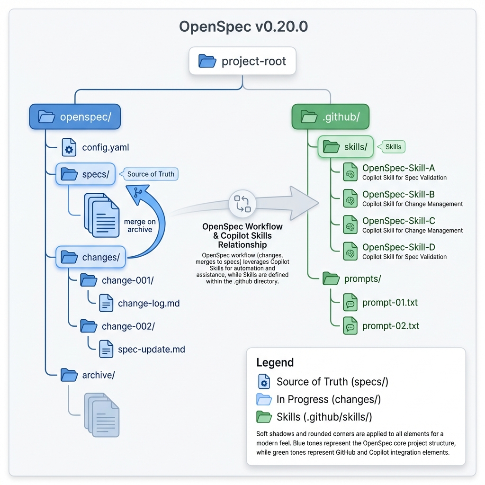
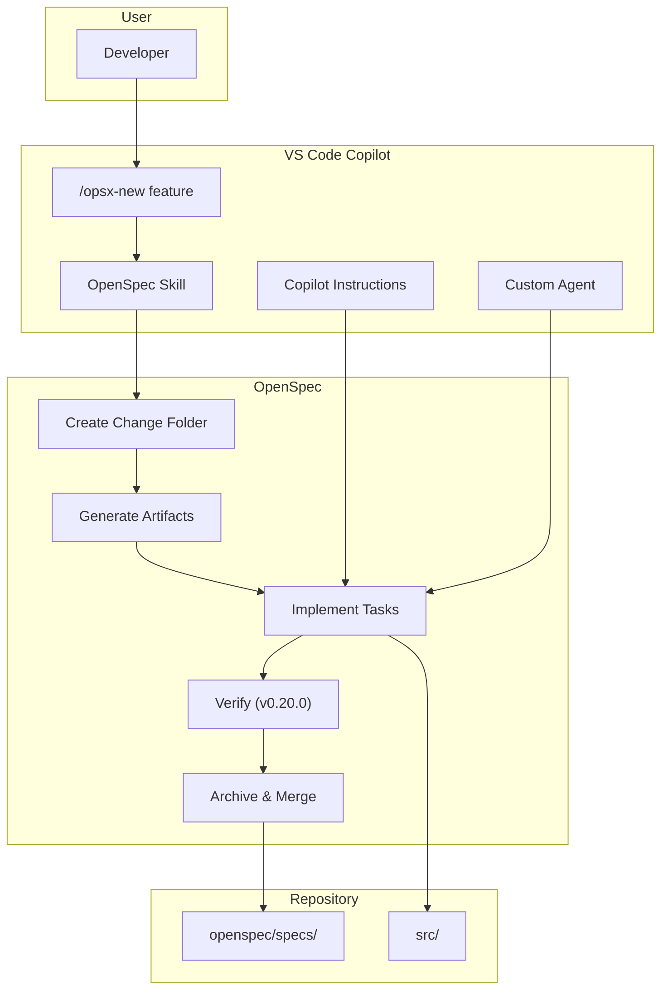

# OpenSpec v0.20.0 - Complete Guide

> **Spec-Driven Development for VS Code Copilot**

This guide covers OpenSpec version 0.20.0, including project structure, workspace maintenance, and integration with VS Code Copilot.



---

## Table of Contents

1. [Version 0.20.0 Features](#version-0200-features)
2. [Project Structure](#project-structure)
3. [File Reference](#file-reference)
4. [Workspace Maintenance](#workspace-maintenance)
5. [Using OpenSpec with VS Code Copilot](#using-openspec-with-vs-code-copilot)
6. [Complete Workflow Example](#complete-workflow-example)
7. [CLI Command Reference](#cli-command-reference)

---

## Version 0.20.0 Features

### What's New in v0.20.0 - Verify Command

This release adds validation tooling and fixes several workflow issues.

| Feature | Description |
|---------|-------------|
| **`/opsx:verify`** | New command to validate implementation matches the spec |
| **Vitest Fix** | Worker parallelism capped to prevent process storms |
| **Agent Validation** | Non-interactive mode for validation commands |
| **PowerShell Fix** | Completions generator now produces valid syntax |

### The Verify Command

```bash
/opsx:verify
```

Catches drift between what you planned and what got built. This command:
- Compares your implementation against the spec artifacts
- Identifies incomplete or missing tasks
- Validates that delta specs match implemented functionality

---

## Project Structure

### Complete Directory Structure

After running `openspec init --tools github-copilot`, your project will have:

```
📁 project-root/
│
├── 📁 openspec/                         ← OpenSpec core directory
│   │
│   ├── 📄 config.yaml                   ← Project configuration
│   │
│   ├── 📁 specs/                        ← Source of truth (current behavior)
│   │   ├── 📁 auth/
│   │   │   └── 📄 spec.md               ← Authentication specifications
│   │   ├── 📁 payments/
│   │   │   └── 📄 spec.md               ← Payment specifications
│   │   └── 📁 ui/
│   │       └── 📄 spec.md               ← UI specifications
│   │
│   ├── 📁 changes/                      ← Active changes (in-progress)
│   │   ├── 📁 add-dark-mode/
│   │   │   ├── 📄 .openspec.yaml        ← Change metadata
│   │   │   ├── 📄 proposal.md           ← WHY: Intent and scope
│   │   │   ├── 📁 specs/                ← WHAT: Delta specs
│   │   │   │   └── 📁 ui/
│   │   │   │       └── 📄 spec.md       ← Delta for UI domain
│   │   │   ├── 📄 design.md             ← HOW: Technical approach
│   │   │   └── 📄 tasks.md              ← STEPS: Implementation checklist
│   │   │
│   │   ├── 📁 fix-login-bug/            ← Another active change
│   │   │   └── ...
│   │   │
│   │   └── 📁 archive/                  ← Completed changes
│   │       ├── 📁 2026-01-15-initial-setup/
│   │       └── 📁 2026-01-20-add-oauth/
│   │
│   └── 📁 schemas/                      ← Custom workflow schemas (optional)
│       └── 📁 my-workflow/
│           ├── 📄 schema.yaml           ← Workflow definition
│           └── 📁 templates/            ← Artifact templates
│               ├── 📄 proposal.md
│               ├── 📄 spec.md
│               ├── 📄 design.md
│               └── 📄 tasks.md
│
├── 📁 .github/                          ← Copilot configuration
│   │
│   ├── 📄 copilot-instructions.md       ← Global Copilot instructions
│   │
│   ├── 📁 skills/                       ← OpenSpec-installed skills
│   │   ├── 📁 openspec-explore/
│   │   │   └── 📄 SKILL.md
│   │   ├── 📁 openspec-new-change/
│   │   │   └── 📄 SKILL.md
│   │   ├── 📁 openspec-continue-change/
│   │   │   └── 📄 SKILL.md
│   │   ├── 📁 openspec-ff-change/
│   │   │   └── 📄 SKILL.md
│   │   ├── 📁 openspec-apply-change/
│   │   │   └── 📄 SKILL.md
│   │   ├── 📁 openspec-verify-change/   ← NEW in v0.20.0
│   │   │   └── 📄 SKILL.md
│   │   ├── 📁 openspec-sync-specs/
│   │   │   └── 📄 SKILL.md
│   │   ├── 📁 openspec-archive-change/
│   │   │   └── 📄 SKILL.md
│   │   ├── 📁 openspec-bulk-archive-change/
│   │   │   └── 📄 SKILL.md
│   │   └── 📁 openspec-onboard/
│   │       └── 📄 SKILL.md
│   │
│   ├── 📁 prompts/                      ← Command bindings for Copilot
│   │   ├── 📄 opsx-new.prompt.md
│   │   ├── 📄 opsx-ff.prompt.md
│   │   ├── 📄 opsx-apply.prompt.md
│   │   ├── 📄 opsx-verify.prompt.md     ← NEW in v0.20.0
│   │   └── 📄 opsx-archive.prompt.md
│   │
│   ├── 📁 agents/                       ← Your custom agents
│   │   └── 📄 ...
│   │
│   └── 📁 instructions/                 ← Your pattern-based instructions
│       └── 📄 ...
│
└── 📁 src/                              ← Your application code
    └── ...
```

### Visual Overview

```
┌─────────────────────────────────────────────────────────────────────────────┐
│                           OPENSPEC PROJECT STRUCTURE                         │
├─────────────────────────────────────────────────────────────────────────────┤
│                                                                              │
│  ┌──────────────────────────────────────────────────────────────────────┐   │
│  │                          openspec/                                    │   │
│  │                                                                       │   │
│  │   ┌─────────────┐    ┌─────────────┐    ┌─────────────────────────┐  │   │
│  │   │   specs/    │◄───│  changes/   │    │      config.yaml        │  │   │
│  │   │             │    │             │    │                         │  │   │
│  │   │ Source of   │merge│ In-progress│    │  • Default schema       │  │   │
│  │   │ truth       │ ◄──│ work        │    │  • Project context      │  │   │
│  │   │             │    │             │    │  • Artifact rules       │  │   │
│  │   │ auth/       │    │ feature-x/  │    │                         │  │   │
│  │   │ payments/   │    │ fix-bug-y/  │    └─────────────────────────┘  │   │
│  │   │ ui/         │    │ archive/    │                                  │   │
│  │   └─────────────┘    └─────────────┘                                  │   │
│  └──────────────────────────────────────────────────────────────────────┘   │
│                                                                              │
│  ┌──────────────────────────────────────────────────────────────────────┐   │
│  │                           .github/                                    │   │
│  │                                                                       │   │
│  │   ┌─────────────┐    ┌─────────────┐    ┌─────────────────────────┐  │   │
│  │   │   skills/   │    │  prompts/   │    │ copilot-instructions.md │  │   │
│  │   │             │    │             │    │                         │  │   │
│  │   │ OpenSpec    │    │ Command     │    │ Your coding standards   │  │   │
│  │   │ installed   │    │ bindings    │    │ and guidelines          │  │   │
│  │   │ skills      │    │             │    │                         │  │   │
│  │   └─────────────┘    └─────────────┘    └─────────────────────────┘  │   │
│  └──────────────────────────────────────────────────────────────────────┘   │
│                                                                              │
└─────────────────────────────────────────────────────────────────────────────┘
```

---

## File Reference

### Core OpenSpec Files

| File | Purpose | When Created |
|------|---------|--------------|
| `openspec/config.yaml` | Project-level configuration | `openspec init` |
| `openspec/specs/<domain>/spec.md` | Domain specifications (source of truth) | First archive |
| `openspec/changes/<name>/.openspec.yaml` | Change metadata | `/opsx:new` |
| `openspec/changes/<name>/proposal.md` | Intent and scope | `/opsx:continue` or `/opsx:ff` |
| `openspec/changes/<name>/specs/<domain>/spec.md` | Delta specifications | `/opsx:continue` or `/opsx:ff` |
| `openspec/changes/<name>/design.md` | Technical approach | `/opsx:continue` or `/opsx:ff` |
| `openspec/changes/<name>/tasks.md` | Implementation checklist | `/opsx:continue` or `/opsx:ff` |

### Sample config.yaml

```yaml
# openspec/config.yaml
schema: spec-driven

context: |
  Tech stack: TypeScript, React, Node.js, PostgreSQL
  API style: RESTful, documented in docs/api.md
  Testing: Jest + React Testing Library
  We value backwards compatibility for all public APIs

rules:
  proposal:
    - Include rollback plan
    - Identify affected teams
  specs:
    - Use Given/When/Then format
    - Reference existing patterns before inventing new ones
  design:
    - Document trade-offs considered
    - Include performance implications
  tasks:
    - Each task should be completable in one session
    - Include verification criteria
```

### Sample Artifact Files

#### proposal.md
```markdown
# Proposal: Add User Preferences

## Intent
Allow users to customize their experience with saved preferences.

## Scope
**In scope:**
- Theme selection (light/dark)
- Language preference
- Notification settings

**Out of scope:**
- Custom themes (future work)
- Preference sync across devices

## Approach
Store preferences in localStorage with server sync on login.
Use React Context for app-wide access.

## Rollback Plan
Revert to default preferences if localStorage unavailable.
```

#### specs/ui/spec.md (Delta)
```markdown
# Delta for UI

## ADDED Requirements

### Requirement: User Preferences Panel
The system SHALL provide a preferences panel accessible from settings.

#### Scenario: Access preferences
- GIVEN a logged-in user
- WHEN the user navigates to Settings > Preferences
- THEN a preferences panel is displayed
- AND all available preference options are shown

#### Scenario: Save preferences
- GIVEN a user on the preferences panel
- WHEN the user changes a preference and clicks Save
- THEN the preference is persisted
- AND a success confirmation is shown

## MODIFIED Requirements

### Requirement: Theme Support
*Previously: System supported only light theme*

The system SHALL support multiple themes based on user preference.
```

#### tasks.md
```markdown
# Tasks

## 1. Backend API
- [ ] 1.1 Create preferences database schema
- [ ] 1.2 Add GET /api/preferences endpoint
- [ ] 1.3 Add PUT /api/preferences endpoint
- [ ] 1.4 Add unit tests for preferences API

## 2. Frontend State
- [ ] 2.1 Create PreferencesContext
- [ ] 2.2 Add usePreferences hook
- [ ] 2.3 Integrate with login flow

## 3. UI Components
- [ ] 3.1 Create PreferencesPanel component
- [ ] 3.2 Add theme toggle
- [ ] 3.3 Add language selector
- [ ] 3.4 Add notification toggles

## 4. Testing
- [ ] 4.1 Add E2E tests for preferences flow
- [ ] 4.2 Test localStorage fallback
```

---

## Workspace Maintenance

### Daily Workflow

```
┌─────────────────────────────────────────────────────────────────────────────┐
│                        DAILY WORKSPACE WORKFLOW                              │
├─────────────────────────────────────────────────────────────────────────────┤
│                                                                              │
│   MORNING                                                                    │
│   ───────                                                                    │
│   1. Check active changes:                                                   │
│      $ openspec list                                                         │
│                                                                              │
│   2. Review change status:                                                   │
│      $ openspec show <change-name>                                           │
│                                                                              │
│   DURING WORK                                                                │
│   ───────────                                                                │
│   3. Continue implementation:                                                │
│      /opsx:apply                                                             │
│                                                                              │
│   4. Validate progress (v0.20.0):                                            │
│      /opsx:verify                                                            │
│                                                                              │
│   END OF DAY                                                                 │
│   ──────────                                                                 │
│   5. Archive completed work:                                                 │
│      /opsx:archive                                                           │
│                                                                              │
│   6. Commit specs to git:                                                    │
│      $ git add openspec/ && git commit -m "Update specs"                     │
│                                                                              │
└─────────────────────────────────────────────────────────────────────────────┘
```

### Managing Active Changes

#### List All Changes
```bash
# View all active changes
openspec list

# Output:
# Active changes:
#   add-dark-mode     UI theme switching support
#   fix-login-bug     Session timeout handling
```

#### View Change Details
```bash
# Interactive view
openspec view

# Show specific change
openspec show add-dark-mode
```

### Archiving Completed Work

```bash
# Archive single change
openspec archive add-dark-mode

# Archive with confirmation skip (CI/CD)
openspec archive add-dark-mode --yes

# Skip spec merge (for tooling-only changes)
openspec archive update-ci-config --skip-specs
```

#### Bulk Archive (v0.21.0+)
```bash
# Archive multiple completed changes
/opsx:bulk-archive
```

### Keeping Specs Updated

```
┌─────────────────────────────────────────────────────────────────────────────┐
│                        SPEC MAINTENANCE LIFECYCLE                            │
├─────────────────────────────────────────────────────────────────────────────┤
│                                                                              │
│   ┌─────────────┐      ┌─────────────┐      ┌─────────────┐                 │
│   │   Create    │      │  Implement  │      │   Archive   │                 │
│   │   Change    │ ───► │   Tasks     │ ───► │   Change    │                 │
│   └─────────────┘      └─────────────┘      └──────┬──────┘                 │
│                                                     │                        │
│                                                     ▼                        │
│                                              ┌─────────────┐                 │
│                                              │Delta Specs  │                 │
│                                              │Merge Into   │                 │
│                                              │Main Specs   │                 │
│                                              └──────┬──────┘                 │
│                                                     │                        │
│                                                     ▼                        │
│   ┌─────────────────────────────────────────────────────────────────────┐   │
│   │                     openspec/specs/                                  │   │
│   │                                                                      │   │
│   │   This is now the SOURCE OF TRUTH for your system's behavior        │   │
│   │   Commit these to git for team synchronization                      │   │
│   │                                                                      │   │
│   └─────────────────────────────────────────────────────────────────────┘   │
│                                                                              │
└─────────────────────────────────────────────────────────────────────────────┘
```

### Updating OpenSpec

When upgrading the OpenSpec CLI:

```bash
# Step 1: Update the package
npm update @fission-ai/openspec

# Step 2: Refresh skill files
openspec update

# Step 3: Force update if needed
openspec update --force
```

### Validation (v0.20.0)

Use the new verify command to check implementation:

```
/opsx:verify

AI:  Verifying add-dark-mode implementation...

     Checking tasks.md:
     ✓ 1.1 ThemeContext - Found in src/contexts/ThemeContext.tsx
     ✓ 1.2 CSS variables - Found in src/styles/globals.css
     ⚠️ 2.3 Header toggle - Not found in Header component
     
     Implementation is 90% complete.
     Missing: Header quick toggle
```

---

## Using OpenSpec with VS Code Copilot

### Installation & Setup

```bash
# Step 1: Install OpenSpec globally
npm install -g @fission-ai/openspec@0.20.0

# Step 2: Navigate to your project
cd your-project

# Step 3: Initialize with GitHub Copilot
openspec init --tools github-copilot
```

### What Gets Installed

| Location | Contents |
|----------|----------|
| `.github/skills/` | 10 OpenSpec skill directories |
| `.github/prompts/` | Slash command bindings |
| `openspec/` | Specs, changes, and configuration |

### Slash Commands for Copilot

| Command | Purpose | Copilot Skill Used |
|---------|---------|-------------------|
| `/opsx-new <name>` | Start a new change | `openspec-new-change` |
| `/opsx-explore` | Think through ideas | `openspec-explore` |
| `/opsx-continue` | Create next artifact | `openspec-continue-change` |
| `/opsx-ff` | Fast-forward all artifacts | `openspec-ff-change` |
| `/opsx-apply` | Implement tasks | `openspec-apply-change` |
| `/opsx-verify` | Validate implementation | `openspec-verify-change` |
| `/opsx-sync` | Sync delta specs | `openspec-sync-specs` |
| `/opsx-archive` | Archive completed change | `openspec-archive-change` |
| `/opsx-bulk-archive` | Archive multiple changes | `openspec-bulk-archive-change` |
| `/opsx-onboard` | Guided tutorial | `openspec-onboard` |

> **Note:** For Copilot, use hyphenated commands (`/opsx-new`) instead of colons (`/opsx:new`).

### Integration Flow



### Combining with Copilot Customizations

#### 1. Instructions Enhancement

Reference OpenSpec workflow in your instructions:

```markdown
# .github/copilot-instructions.md

## Development Process

All new features should use OpenSpec for structured development:

1. **Start**: `/opsx-new <feature-name>`
2. **Plan**: `/opsx-ff` to generate artifacts
3. **Implement**: `/opsx-apply` 
4. **Verify**: `/opsx-verify` (v0.20.0+)
5. **Complete**: `/opsx-archive`

Always check `openspec/specs/` for existing behavior before modifying.
```

#### 2. Agent Integration

Create agents aligned with OpenSpec phases:

```markdown
# .github/agents/spec-writer.agent.md
---
name: Spec Writer
description: Creates OpenSpec artifacts
model: Claude Sonnet 4
tools: ['codebase', 'search']
---

You create OpenSpec artifacts following the spec-driven workflow.

When creating specs:
- Use Given/When/Then format
- Reference existing specs in openspec/specs/
- Mark changes as ADDED/MODIFIED/REMOVED

When creating tasks:
- Make each task atomic and testable
- Group related tasks under headings
- Use hierarchical numbering (1.1, 1.2, etc.)
```

#### 3. Prompt Files for Common Patterns

```markdown
# .github/prompts/feature-spec.prompt.md
---
description: Generate OpenSpec artifacts for a new feature
name: Feature Spec
---

Create OpenSpec artifacts for: ${input:featureName:Enter feature name}

1. First run `/opsx-new ${input:featureName}`
2. Then generate proposal.md with:
   - Intent section
   - Scope (in/out)
   - Approach
   - Rollback plan

Reference existing specs in openspec/specs/ for context.
```

---

## Complete Workflow Example

### Scenario: Adding Dark Mode

```
┌─────────────────────────────────────────────────────────────────────────────┐
│                     COMPLETE WORKFLOW: ADD DARK MODE                         │
└─────────────────────────────────────────────────────────────────────────────┘

STEP 1: EXPLORE (Optional)
══════════════════════════
User: /opsx-explore

AI:   What would you like to explore?

User: I want to add dark mode support. What's the best approach?

AI:   Let me analyze your codebase...

      Current state:
      - Using CSS Modules in src/styles/
      - No theme system in place
      - 15 components with hardcoded colors

      Recommended approach:
      1. CSS Custom Properties for theming
      2. React Context for state management
      3. localStorage for persistence

      Ready to start? Use /opsx-new add-dark-mode

────────────────────────────────────────────────────────────────────────────────

STEP 2: START CHANGE
════════════════════
User: /opsx-new add-dark-mode

AI:   Created openspec/changes/add-dark-mode/
      Schema: spec-driven
      Ready to create: proposal

      Use /opsx-continue for step-by-step or /opsx-ff for all at once.

────────────────────────────────────────────────────────────────────────────────

STEP 3: CREATE ARTIFACTS
════════════════════════
User: /opsx-ff

AI:   Fast-forwarding add-dark-mode...

      ✓ proposal.md — Intent: Support dark mode for reduced eye strain
        - Scope: Theme toggle, system preference detection, persistence
        - Approach: CSS custom properties + React Context

      ✓ specs/ui/spec.md — Delta specifications
        - ADDED: Theme selection requirement
        - ADDED: System preference detection scenario
        - ADDED: Persistence scenario

      ✓ design.md — Technical approach
        - ThemeContext with light/dark state
        - CSS variables applied to :root
        - localStorage for cross-session persistence

      ✓ tasks.md — Implementation checklist
        - 8 tasks across 3 phases

      Ready for implementation!

────────────────────────────────────────────────────────────────────────────────

STEP 4: IMPLEMENT
═════════════════
User: /opsx-apply

AI:   Working through tasks for add-dark-mode...

      ## 1. Theme Infrastructure
      ✓ 1.1 Created src/contexts/ThemeContext.tsx
      ✓ 1.2 Added CSS variables to src/styles/theme.css
      ✓ 1.3 Implemented localStorage persistence

      ## 2. UI Components  
      ✓ 2.1 Created src/components/ThemeToggle.tsx
      ✓ 2.2 Added toggle to SettingsPage
      ✓ 2.3 Added quick toggle to Header

      ## 3. Styling
      ✓ 3.1 Defined dark theme palette
      ✓ 3.2 Updated 15 components to use CSS variables

      All tasks complete!

────────────────────────────────────────────────────────────────────────────────

STEP 5: VERIFY (v0.20.0)
════════════════════════
User: /opsx-verify

AI:   Verifying add-dark-mode implementation...

      Checking implementation against specs:

      ✓ Requirement: Theme Selection
        ✓ Scenario: Manual toggle - Toggle works correctly
        ✓ Scenario: System preference - Detects prefers-color-scheme

      ✓ Requirement: Theme Persistence  
        ✓ Scenario: Save preference - Uses localStorage
        ✓ Scenario: Load preference - Restores on page load

      Checking tasks.md:
      ✓ All 8 tasks marked complete
      ✓ All referenced files exist

      ══════════════════════════════════════════
      ✓ Implementation matches specifications
      ══════════════════════════════════════════

      Ready to archive with /opsx-archive

────────────────────────────────────────────────────────────────────────────────

STEP 6: ARCHIVE
═══════════════
User: /opsx-archive

AI:   Archiving add-dark-mode...

      ✓ Validated change (all checks passed)
      ✓ Merged delta specs into openspec/specs/ui/spec.md
      ✓ Moved to openspec/changes/archive/2026-02-01-add-dark-mode/

      Done! The specs are now the updated source of truth.

      Recommended: Commit to git
      $ git add openspec/ && git commit -m "Add dark mode feature"

────────────────────────────────────────────────────────────────────────────────
```

---

## CLI Command Reference

### Setup Commands

| Command | Description |
|---------|-------------|
| `openspec init [path]` | Initialize OpenSpec in project |
| `openspec init --tools github-copilot` | Initialize with Copilot |
| `openspec init --tools all` | Initialize for all AI tools |
| `openspec update` | Refresh skill files after upgrade |
| `openspec update --force` | Force refresh even if up-to-date |

### Browsing Commands

| Command | Description |
|---------|-------------|
| `openspec list` | List active changes |
| `openspec list --specs` | List all specs |
| `openspec list --json` | JSON output for scripts |
| `openspec view` | Interactive dashboard |
| `openspec show <name>` | Show change or spec details |

### Lifecycle Commands

| Command | Description |
|---------|-------------|
| `openspec archive <name>` | Archive a completed change |
| `openspec archive --yes` | Skip confirmation |
| `openspec archive --skip-specs` | Don't merge specs (tooling changes) |

### Schema Commands

| Command | Description |
|---------|-------------|
| `openspec schema init <name>` | Create new schema |
| `openspec schema fork <from> <to>` | Fork existing schema |
| `openspec schema validate <name>` | Validate schema |
| `openspec schema which <name>` | Show schema source |

### Configuration Commands

| Command | Description |
|---------|-------------|
| `openspec config` | View configuration |
| `openspec validate` | Validate project structure |
| `openspec feedback` | Submit feedback |

---

## Related Documentation

- [OpenSpec Integration Overview](./openspec-integration.md)
- [VS Code Copilot Customization Guide](./Prompt.md)
- [Architecture Overview](./architecture.md)
- [OpenSpec GitHub Repository](https://github.com/Fission-AI/OpenSpec)

---

*Last Updated: February 2026*
