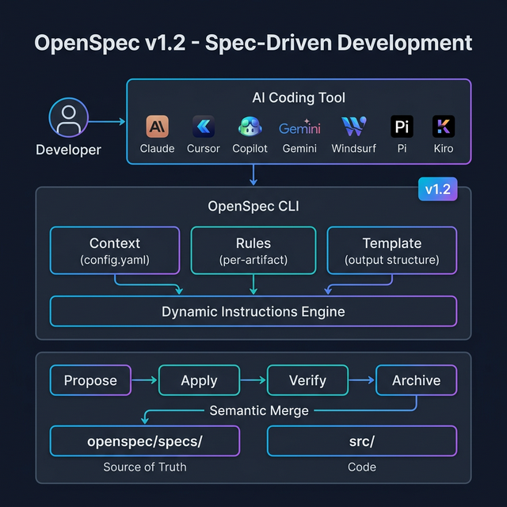
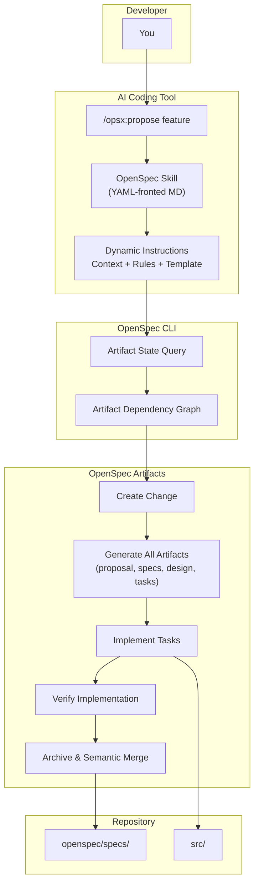

# OpenSpec v1.2.0 — Complete Guide

> **Spec-Driven Development for 21+ AI Coding Assistants**

This guide covers OpenSpec version 1.2.0, including the complete OPSX action-based workflow, profiles, the propose workflow, project structure, and integration with all major AI coding tools.



---

## Table of Contents

1. [Version Evolution (v0.20 → v1.2)](#version-evolution-v020--v12)
2. [v1.0 — The OPSX Release](#v10--the-opsx-release)
3. [v1.2 — Latest Features](#v12--latest-features)
4. [Project Structure](#project-structure)
5. [File Reference](#file-reference)
6. [Supported AI Tools](#supported-ai-tools)
7. [Slash Commands Reference](#slash-commands-reference)
8. [Workspace Maintenance](#workspace-maintenance)
9. [Complete Workflow Example](#complete-workflow-example)
10. [CLI Command Reference](#cli-command-reference)
11. [Migration Guide (v0.x → v1.x)](#migration-guide-v0x--v1x)

---

## Version Evolution (v0.20 → v1.2)

```
┌─────────────────────────────────────────────────────────────────────────────────┐
│                      OPENSPEC VERSION EVOLUTION TIMELINE                        │
├─────────────────────────────────────────────────────────────────────────────────┤
│                                                                                 │
│  v0.20       v0.21       v0.22       v0.23       v1.0        v1.1       v1.2   │
│    │           │           │           │           │           │           │     │
│    ●───────────●───────────●───────────●═══════════●───────────●───────────●     │
│    │           │           │           │           ║           │           │     │
│  Verify    Feedback    Project     Bulk       ═══════════  Codex      Profiles  │
│  Command   Command    Config &    Archive    ║ OPSX 1.0 ║  Paths &   Propose   │
│  Vitest    Nix        Schemas               ║ REWRITE  ║  Windsurf  Auto-      │
│  Fix       Support    Mgmt                  ║ 21 Tools ║  Fixes     Detect     │
│                                             ║ Actions  ║           Pi & Kiro   │
│                                             ═══════════            Support     │
│                                                                                 │
│  Legend: ● Minor Release   ═══ Major Release                                   │
│                                                                                 │
└─────────────────────────────────────────────────────────────────────────────────┘
```

### Version Highlights Summary

| Version | Release | Key Features |
|---------|---------|-------------|
| **v0.20** | Oct 2025 | `/opsx:verify` command, Vitest fix, agent validation |
| **v0.21** | Nov 2025 | `openspec feedback` command, Nix flake support, explore guardrails |
| **v0.22** | Nov 2025 | Project-level `config.yaml`, project-local schemas, schema management |
| **v0.23** | Dec 2025 | `/opsx:bulk-archive` skill, simplified setup defaults |
| **v1.0** | Jan 2026 | **OPSX rewrite** — Action-based commands, 21 AI tools, semantic spec syncing, dynamic instructions, onboarding |
| **v1.0.1** | Jan 2026 | Archive path fix in docs |
| **v1.0.2** | Jan 2026 | Spec naming convention, task checkbox format |
| **v1.1** | Feb 2026 | Codex global path support, archive on cross-device paths, slash command hints, Windsurf adapter fix |
| **v1.1.1** | Feb 2026 | OpenCode command reference fix (`/opsx-` format) |
| **v1.2** | Feb 2026 | **Profiles**, **Propose workflow**, AI tool auto-detection, Pi & Kiro support, sync prune, config drift warning |

---

## v1.0 — The OPSX Release

> **The biggest release in OpenSpec history** — a complete rebuild of the workflow system.

### Breaking Changes

> [!CAUTION]
> If upgrading from v0.x, these are **breaking changes**:
>
> - **Old commands removed** — `/openspec:proposal`, `/openspec:apply`, and `/openspec:archive` no longer exist
> - **Config files removed** — Tool-specific instruction files (`CLAUDE.md`, `.cursorrules`, `AGENTS.md`, `project.md`) are no longer generated
> - **Migration** — Run `openspec init` to upgrade. Legacy artifacts are detected and cleaned up with confirmation.

### From Static Prompts to Dynamic Instructions

```
┌─────────────────────────────────────────────────────────────────────────────────┐
│                    DYNAMIC INSTRUCTION ARCHITECTURE (v1.0+)                     │
├─────────────────────────────────────────────────────────────────────────────────┤
│                                                                                 │
│    ┌─────────────────┐  ┌─────────────────┐  ┌─────────────────┐               │
│    │     CONTEXT      │  │      RULES      │  │    TEMPLATE     │               │
│    │                  │  │                  │  │                 │               │
│    │  Project info    │  │  Per-artifact    │  │  Output file    │               │
│    │  from            │  │  constraints     │  │  structure      │               │
│    │  config.yaml     │  │                  │  │                 │               │
│    │                  │  │  "propose spike  │  │  proposal.md    │               │
│    │  • Tech stack    │  │   tasks for      │  │  spec.md        │               │
│    │  • Conventions   │  │   unknowns"      │  │  design.md      │               │
│    │  • API style     │  │                  │  │  tasks.md       │               │
│    └────────┬─────────┘  └────────┬─────────┘  └────────┬───────┘               │
│             │                     │                      │                       │
│             └─────────────────────┼──────────────────────┘                       │
│                                   ▼                                              │
│                    ┌──────────────────────────────┐                              │
│                    │   DYNAMICALLY ASSEMBLED      │                              │
│                    │   INSTRUCTIONS                │                              │
│                    │                               │                              │
│                    │   AI queries CLI for:          │                              │
│                    │   • Which artifacts exist      │                              │
│                    │   • What's ready to create     │                              │
│                    │   • What dependencies met      │                              │
│                    │   • What actions available      │                              │
│                    └──────────────────────────────┘                              │
│                                                                                 │
│    BEFORE (v0.x): Same static instructions every time                           │
│    NOW (v1.0+):   Context-aware, state-driven instructions                     │
│                                                                                 │
└─────────────────────────────────────────────────────────────────────────────────┘
```

### From Phase-Locked to Action-Based

**Before (v0.x):** Linear workflow — `proposal → apply → archive`. Couldn't easily go back or iterate.

**Now (v1.0+):** Flexible actions on a change. Edit any artifact anytime. The artifact graph tracks state automatically.

| Command | What It Does |
|---------|-------------|
| `/opsx:explore` | Think through ideas before committing to a change |
| `/opsx:new` | Start a new change |
| `/opsx:propose` | **NEW in v1.2** — Create complete change proposal in one step |
| `/opsx:continue` | Create one artifact at a time (step-through) |
| `/opsx:ff` | Create all planning artifacts at once (fast-forward) |
| `/opsx:apply` | Implement tasks |
| `/opsx:verify` | Validate implementation matches artifacts |
| `/opsx:sync` | Sync delta specs to main specs |
| `/opsx:archive` | Archive completed change |
| `/opsx:bulk-archive` | Archive multiple changes with conflict detection |
| `/opsx:onboard` | Guided 15-minute walkthrough of the complete workflow |

### Semantic Spec Syncing

**Before (v0.x):** Spec updates required manual merging or wholesale file replacement.

**Now (v1.0+):** Delta specs use semantic markers that AI understands:

```markdown
## ADDED Requirements
New requirements to add to the main spec.

## MODIFIED Requirements
Partial updates — add scenario without copying existing ones.

## REMOVED Requirements
Delete with reason and migration notes.

## RENAMED Requirements
Rename preserving content.
```

Archive parses these at the **requirement level**, not brittle header matching.

### From Scattered Files to Agent Skills

**Before (v0.x):** 8+ config files at project root + slash commands scattered across 21 tool-specific locations with different formats.

**Now (v1.0+):** Single skills directory with YAML-fronted markdown files. Auto-detected by Claude Code, Cursor, Windsurf, and more. Cross-editor compatible.

---

## v1.2 — Latest Features

### Profile System

Control which skills get installed with profiles:

```bash
# View current profile
openspec config profile

# Switch to core profile (4 essential workflows)
openspec config profile core

# Switch to custom profile (pick any subset)
openspec config profile custom
```

| Profile | Workflows Included | Best For |
|---------|-------------------|----------|
| **Core** | `new`, `ff`, `apply`, `archive` | Lean setups, beginners |
| **Custom** | Any subset you choose | Power users, teams with specific needs |

### Propose Workflow

**One-step change proposals** — no need to run `new` then `ff` separately:

```
User: /opsx:propose Add user preferences

AI:   Creating complete change proposal...

      ✓ Created openspec/changes/add-user-preferences/
      ✓ proposal.md — Intent, scope, approach
      ✓ specs/settings/spec.md — Delta specifications
      ✓ design.md — Technical approach
      ✓ tasks.md — Implementation checklist

      Ready for implementation! Use /opsx:apply
```

> [!TIP]
> `/opsx:propose` is the recommended way to start new changes in v1.2+. It combines `/opsx:new` + `/opsx:ff` into a single, streamlined step.

### AI Tool Auto-Detection

`openspec init` now scans your project for existing AI tool directories and pre-selects detected tools:

```
$ openspec init

🔍 Detected existing tools:
   ✓ .claude/     → Claude Code
   ✓ .cursor/     → Cursor
   ✓ .github/     → GitHub Copilot

Select tools to configure: [All detected pre-selected]
```

### New Tool Support

| Tool | Version Added | Notes |
|------|--------------|-------|
| **Pi** (pi.dev) | v1.2 | Pi coding agent — prompt and skill generation |
| **AWS Kiro** | v1.2 | AWS Kiro IDE — prompt and skill generation |

### Sync Prunes Deselected Workflows

`openspec update` now removes command files and skill directories for workflows you've deselected, keeping your project clean.

### Config Drift Warning

`openspec config list` warns when global config is out of sync with the current project, preventing unexpected behavior from stale configurations.

---

## Project Structure

### Complete Directory Structure (v1.0+)

After running `openspec init`, your project will have:

```
📁 project-root/
│
├── 📁 openspec/                         ← OpenSpec core directory
│   │
│   ├── 📄 config.yaml                   ← Project configuration
│   │
│   ├── 📁 specs/                        ← Source of truth (current behavior)
│   │   ├── 📁 auth/
│   │   │   └── 📄 spec.md               ← Authentication specifications
│   │   ├── 📁 payments/
│   │   │   └── 📄 spec.md               ← Payment specifications
│   │   └── 📁 ui/
│   │       └── 📄 spec.md               ← UI specifications
│   │
│   ├── 📁 changes/                      ← Active changes (in-progress)
│   │   ├── 📁 add-dark-mode/
│   │   │   ├── 📄 .openspec.yaml        ← Change metadata
│   │   │   ├── 📄 proposal.md           ← WHY: Intent and scope
│   │   │   ├── 📁 specs/                ← WHAT: Delta specs (semantic markers)
│   │   │   │   └── 📁 ui/
│   │   │   │       └── 📄 spec.md       ← Delta for UI domain
│   │   │   ├── 📄 design.md             ← HOW: Technical approach
│   │   │   └── 📄 tasks.md              ← STEPS: Implementation checklist
│   │   │
│   │   └── 📁 archive/                  ← Completed changes
│   │       ├── 📁 2026-01-15-initial-setup/
│   │       └── 📁 2026-01-20-add-oauth/
│   │
│   └── 📁 schemas/                      ← Custom workflow schemas (v0.22+)
│       └── 📁 my-workflow/
│           ├── 📄 schema.yaml           ← Workflow definition
│           └── 📁 templates/            ← Artifact templates
│               ├── 📄 proposal.md
│               ├── 📄 spec.md
│               ├── 📄 design.md
│               └── 📄 tasks.md
│
├── 📁 .claude/                          ← Claude Code skills (auto-detected)
│   └── 📁 skills/
│       ├── 📁 openspec-explore/
│       ├── 📁 openspec-new-change/
│       ├── 📁 openspec-propose-change/  ← NEW in v1.2
│       ├── 📁 openspec-continue-change/
│       ├── 📁 openspec-ff-change/
│       ├── 📁 openspec-apply-change/
│       ├── 📁 openspec-verify-change/
│       ├── 📁 openspec-sync-specs/
│       ├── 📁 openspec-archive-change/
│       ├── 📁 openspec-bulk-archive-change/
│       └── 📁 openspec-onboard/
│
├── 📁 .github/                          ← GitHub Copilot skills & prompts
│   ├── 📁 skills/                       ← Same skill structure
│   └── 📁 prompts/                      ← Slash command bindings
│
├── 📁 .cursor/                          ← Cursor-specific skills
│
└── 📁 src/                              ← Your application code
    └── ...
```

> [!NOTE]
> In v1.0+, skills are installed into **tool-native directories** (`.claude/skills/`, `.github/skills/`, `.cursor/`, etc.) instead of a single location. Each tool gets skills in its expected format for seamless auto-detection.

### Visual Overview

```
┌─────────────────────────────────────────────────────────────────────────────────┐
│                    OPENSPEC v1.2 PROJECT ARCHITECTURE                           │
├─────────────────────────────────────────────────────────────────────────────────┤
│                                                                                 │
│  ┌──────────────────────────────────────────────────────────────────────────┐   │
│  │                          openspec/                                       │   │
│  │                                                                          │   │
│  │   ┌──────────────┐   ┌──────────────┐   ┌────────────────────────────┐  │   │
│  │   │   specs/     │◄──│  changes/    │   │      config.yaml           │  │   │
│  │   │              │   │              │   │                            │  │   │
│  │   │ Source of    │   │ In-progress  │   │  • Schema selection        │  │   │
│  │   │ truth        │   │ work         │   │  • Project context         │  │   │
│  │   │              │   │              │   │  • Artifact rules          │  │   │
│  │   │ Semantic     │   │ /propose     │   │  • Profile config          │  │   │
│  │   │ merging      │   │ /apply       │   │                            │  │   │
│  │   │ on archive   │   │ /verify      │   └────────────────────────────┘  │   │
│  │   └──────────────┘   └──────────────┘                                   │   │
│  │                                         ┌────────────────────────────┐  │   │
│  │                                         │      schemas/ (v0.22+)     │  │   │
│  │                                         │  Custom artifact workflows │  │   │
│  │                                         └────────────────────────────┘  │   │
│  └──────────────────────────────────────────────────────────────────────────┘   │
│                                                                                 │
│  ┌──────────────────────────────────────────────────────────────────────────┐   │
│  │              AI TOOL SKILLS (auto-installed per tool)                    │   │
│  │                                                                          │   │
│  │  ┌─────────────┐ ┌─────────────┐ ┌──────────┐ ┌────────────────────┐   │   │
│  │  │.claude/     │ │.github/     │ │.cursor/  │ │  20+ other tools   │   │   │
│  │  │ skills/     │ │ skills/     │ │          │ │                    │   │   │
│  │  │             │ │ prompts/    │ │ Cursor   │ │  Windsurf, Gemini  │   │   │
│  │  │ YAML-front  │ │             │ │ native   │ │  CLI, Amazon Q,    │   │   │
│  │  │ markdown    │ │ Copilot     │ │ format   │ │  Continue, Cline,  │   │   │
│  │  │             │ │ bindings    │ │          │ │  RooCode, Pi, Kiro │   │   │
│  │  └─────────────┘ └─────────────┘ └──────────┘ └────────────────────┘   │   │
│  └──────────────────────────────────────────────────────────────────────────┘   │
│                                                                                 │
└─────────────────────────────────────────────────────────────────────────────────┘
```

---

## File Reference

### Core OpenSpec Files

| File | Purpose | When Created |
|------|---------|-------------|
| `openspec/config.yaml` | Project-level configuration (v0.22+) | `openspec init` |
| `openspec/specs/<capability>/spec.md` | Capability specifications (source of truth) | First archive |
| `openspec/changes/<name>/.openspec.yaml` | Change metadata | `/opsx:new` or `/opsx:propose` |
| `openspec/changes/<name>/proposal.md` | Intent and scope | `/opsx:propose`, `/opsx:continue`, or `/opsx:ff` |
| `openspec/changes/<name>/specs/<domain>/spec.md` | Delta specifications (semantic markers) | `/opsx:propose`, `/opsx:continue`, or `/opsx:ff` |
| `openspec/changes/<name>/design.md` | Technical approach | `/opsx:propose`, `/opsx:continue`, or `/opsx:ff` |
| `openspec/changes/<name>/tasks.md` | Implementation checklist (`- [ ]` format) | `/opsx:propose`, `/opsx:continue`, or `/opsx:ff` |

> [!IMPORTANT]
> As of v1.0.2, specs should be named after **capabilities** (`specs/<capability>/spec.md`), not after changes. Tasks must use `- [ ]` checkbox format for the apply phase to track progress.

### Sample config.yaml

```yaml
# openspec/config.yaml
schema: spec-driven

context: |
  Tech stack: TypeScript, React, Node.js, PostgreSQL
  API style: RESTful, documented in docs/api.md
  Testing: Jest + React Testing Library
  We value backwards compatibility for all public APIs

rules:
  proposal:
    - Include rollback plan
    - Identify affected teams
  specs:
    - Use Given/When/Then format
    - Reference existing patterns before inventing new ones
  design:
    - Document trade-offs considered
    - Include performance implications
  tasks:
    - Each task should be completable in one session
    - Include verification criteria
    - Propose spike tasks for unknowns
```

### Sample Delta Spec (Semantic Markers)

```markdown
# Delta for UI

## ADDED Requirements

### Requirement: User Preferences Panel
The system SHALL provide a preferences panel accessible from settings.

#### Scenario: Access preferences
- GIVEN a logged-in user
- WHEN the user navigates to Settings > Preferences
- THEN a preferences panel is displayed
- AND all available preference options are shown

#### Scenario: Save preferences
- GIVEN a user on the preferences panel
- WHEN the user changes a preference and clicks Save
- THEN the preference is persisted
- AND a success confirmation is shown

## MODIFIED Requirements

### Requirement: Theme Support
*Previously: System supported only light theme*

The system SHALL support multiple themes based on user preference.

## REMOVED Requirements

### Requirement: Legacy Settings Page
**Reason:** Replaced by the new Preferences Panel.
**Migration:** All settings from the legacy page are available in the new panel.
```

---

## Supported AI Tools

OpenSpec v1.2 supports **23 AI coding assistants** with native slash commands:

| Tool | Category | Init Flag |
|------|----------|-----------|
| **Claude Code** | AI IDE Agent | `claude-code` |
| **Cursor** | AI IDE | `cursor` |
| **Windsurf** | AI IDE | `windsurf` |
| **GitHub Copilot** | IDE Extension | `github-copilot` |
| **Amazon Q** | IDE Extension | `amazon-q` |
| **Gemini CLI** | CLI Agent | `gemini-cli` |
| **Continue** | IDE Extension | `continue` |
| **Cline** | IDE Extension | `cline` |
| **RooCode** | IDE Extension | `roocode` |
| **Kilo Code** | IDE Extension | `kilo-code` |
| **Pi** (pi.dev) | Coding Agent | `pi` |
| **AWS Kiro** | IDE | `kiro` |
| **Auggie** | IDE Extension | `auggie` |
| **CodeBuddy** | IDE Extension | `codebuddy` |
| **Qoder** | IDE Extension | `qoder` |
| **Qwen** | AI Agent | `qwen` |
| **CoStrict** | IDE Extension | `costrict` |
| **Crush** | IDE Extension | `crush` |
| **Factory** | IDE Extension | `factory` |
| **OpenCode** | CLI Agent | `opencode` |
| **Antigravity** | AI Agent | `antigravity` |
| **iFlow** | CLI Agent | `iflow` |
| **Codex** | CLI Agent | `codex` |

```bash
# Initialize with specific tools
openspec init --tools claude-code cursor github-copilot

# Initialize with all supported tools
openspec init --tools all

# Auto-detect existing tools (v1.2+)
openspec init
# → Scans for .claude/, .cursor/, .github/, etc. and pre-selects
```

---

## Slash Commands Reference

### AI Agent Commands

| Command | Purpose | Skill Used |
|---------|---------|------------|
| `/opsx:explore` | Think through ideas before committing | `openspec-explore` |
| `/opsx:new <name>` | Start a new change | `openspec-new-change` |
| `/opsx:propose <name>` | **v1.2** — One-step complete change proposal | `openspec-propose-change` |
| `/opsx:continue` | Create next artifact (step-through) | `openspec-continue-change` |
| `/opsx:ff` | Fast-forward all planning artifacts | `openspec-ff-change` |
| `/opsx:apply` | Implement tasks | `openspec-apply-change` |
| `/opsx:verify` | Validate implementation matches spec | `openspec-verify-change` |
| `/opsx:sync` | Sync delta specs to main specs | `openspec-sync-specs` |
| `/opsx:archive` | Archive completed change | `openspec-archive-change` |
| `/opsx:bulk-archive` | Archive multiple changes at once | `openspec-bulk-archive-change` |
| `/opsx:onboard` | Guided 15-minute tutorial | `openspec-onboard` |

> [!NOTE]
> **Command format varies by tool:**
>
> - Claude Code, Cursor, Gemini CLI: `/opsx:command`
> - GitHub Copilot: `/opsx-command` (hyphenated)
> - OpenCode: `/opsx-command` (hyphenated, fixed in v1.1.1)

### Integration Flow



---

## Workspace Maintenance

### Daily Workflow

```
┌─────────────────────────────────────────────────────────────────────────────────┐
│                         DAILY WORKSPACE WORKFLOW (v1.2)                         │
├─────────────────────────────────────────────────────────────────────────────────┤
│                                                                                 │
│   MORNING                                                                       │
│   ───────                                                                       │
│   1. Check active changes:                                                      │
│      $ openspec list                                                            │
│                                                                                 │
│   2. Review change status:                                                      │
│      $ openspec show <change-name>                                              │
│                                                                                 │
│   START NEW WORK                                                                │
│   ──────────────                                                                │
│   3. Start a new feature (one-step):                                            │
│      /opsx:propose <feature-name>                                               │
│                                                                                 │
│   DURING WORK                                                                   │
│   ───────────                                                                   │
│   4. Implement tasks:                                                           │
│      /opsx:apply                                                                │
│                                                                                 │
│   5. Validate progress:                                                         │
│      /opsx:verify                                                               │
│                                                                                 │
│   END OF DAY                                                                    │
│   ──────────                                                                    │
│   6. Archive completed work:                                                    │
│      /opsx:archive                                                              │
│                                                                                 │
│   7. Bulk archive if multiple complete:                                         │
│      /opsx:bulk-archive                                                         │
│                                                                                 │
│   8. Commit specs to git:                                                       │
│      $ git add openspec/ && git commit -m "Update specs"                        │
│                                                                                 │
└─────────────────────────────────────────────────────────────────────────────────┘
```

### Managing Profiles (v1.2+)

```bash
# View current profile
openspec config profile

# Switch to core (4 essential workflows)
openspec config profile core

# Switch to custom (select specific workflows)
openspec config profile custom

# After changing profile, update to apply
openspec update
```

### Keeping Skills Updated

```bash
# Step 1: Update the package
npm update @fission-ai/openspec

# Step 2: Refresh skill files (prunes deselected workflows in v1.2+)
openspec update

# Step 3: Force update if needed
openspec update --force
```

### Spec Maintenance Lifecycle

```
┌─────────────────────────────────────────────────────────────────────────────────┐
│                     SPEC MAINTENANCE LIFECYCLE (v1.0+)                          │
├─────────────────────────────────────────────────────────────────────────────────┤
│                                                                                 │
│   ┌──────────────┐     ┌──────────────┐     ┌──────────────┐                   │
│   │   Propose    │     │  Implement   │     │   Verify     │                   │
│   │   Change     │ ──► │   Tasks      │ ──► │   Match      │                   │
│   │  (one-step)  │     │  /opsx:apply │     │  /opsx:verify│                   │
│   └──────────────┘     └──────────────┘     └──────┬───────┘                   │
│                                                     │                           │
│                                                     ▼                           │
│                                              ┌──────────────┐                   │
│                                              │   Archive    │                   │
│                                              │              │                   │
│                                              │  Semantic    │                   │
│                                              │  merge of    │                   │
│                                              │  delta specs │                   │
│                                              └──────┬───────┘                   │
│                                                     │                           │
│                                                     ▼                           │
│   ┌─────────────────────────────────────────────────────────────────────────┐   │
│   │                     openspec/specs/                                      │   │
│   │                                                                          │   │
│   │   ADDED requirements → appended                                         │   │
│   │   MODIFIED requirements → updated in-place                              │   │
│   │   REMOVED requirements → deleted with notes                             │   │
│   │   RENAMED requirements → renamed preserving content                     │   │
│   │                                                                          │   │
│   │   This is now the SOURCE OF TRUTH for your system's behavior            │   │
│   └─────────────────────────────────────────────────────────────────────────┘   │
│                                                                                 │
└─────────────────────────────────────────────────────────────────────────────────┘
```

### Config Drift Detection (v1.2+)

```bash
$ openspec config list

⚠️  Config drift detected:
    Global config has tools: [claude-code, cursor, github-copilot]
    Project config has tools: [claude-code, cursor]

    Run 'openspec update' to sync project with global config.
```

---

## Complete Workflow Example

### Scenario: Adding Dark Mode (v1.2 Workflow)

```
┌─────────────────────────────────────────────────────────────────────────────────┐
│                     COMPLETE WORKFLOW: ADD DARK MODE (v1.2)                     │
└─────────────────────────────────────────────────────────────────────────────────┘

STEP 1: EXPLORE (Optional)
══════════════════════════
User: /opsx:explore

AI:   What would you like to explore?

User: I want to add dark mode support. What's the best approach?

AI:   Let me analyze your codebase...

      Current state:
      - Using CSS Modules in src/styles/
      - No theme system in place
      - 15 components with hardcoded colors

      Recommended approach:
      1. CSS Custom Properties for theming
      2. React Context for state management
      3. localStorage for persistence

      Ready to start? Use /opsx:propose add-dark-mode

────────────────────────────────────────────────────────────────────────────────────

STEP 2: PROPOSE (One-Step — NEW in v1.2)
════════════════════════════════════════
User: /opsx:propose add-dark-mode

AI:   Creating complete change proposal for add-dark-mode...

      ✓ Created openspec/changes/add-dark-mode/
      ✓ proposal.md — Intent: Support dark mode for reduced eye strain
        - Scope: Theme toggle, system preference detection, persistence
        - Approach: CSS custom properties + React Context
        - Rollback: Revert to default theme

      ✓ specs/ui/spec.md — Delta specifications
        - ADDED: Theme selection requirement
        - ADDED: System preference detection scenario
        - ADDED: Persistence scenario

      ✓ design.md — Technical approach
        - ThemeContext with light/dark state
        - CSS variables applied to :root
        - localStorage for cross-session persistence

      ✓ tasks.md — Implementation checklist
        - 8 tasks across 3 phases

      All planning artifacts complete! Ready for implementation.

────────────────────────────────────────────────────────────────────────────────────

STEP 3: IMPLEMENT
═════════════════
User: /opsx:apply

AI:   Working through tasks for add-dark-mode...

      ## 1. Theme Infrastructure
      ✓ 1.1 Created src/contexts/ThemeContext.tsx
      ✓ 1.2 Added CSS variables to src/styles/theme.css
      ✓ 1.3 Implemented localStorage persistence

      ## 2. UI Components
      ✓ 2.1 Created src/components/ThemeToggle.tsx
      ✓ 2.2 Added toggle to SettingsPage
      ✓ 2.3 Added quick toggle to Header

      ## 3. Styling
      ✓ 3.1 Defined dark theme palette
      ✓ 3.2 Updated 15 components to use CSS variables

      All tasks complete!

────────────────────────────────────────────────────────────────────────────────────

STEP 4: VERIFY
══════════════
User: /opsx:verify

AI:   Verifying add-dark-mode implementation...

      Checking implementation against specs:

      ✓ Requirement: Theme Selection
        ✓ Scenario: Manual toggle — Toggle works correctly
        ✓ Scenario: System preference — Detects prefers-color-scheme

      ✓ Requirement: Theme Persistence
        ✓ Scenario: Save preference — Uses localStorage
        ✓ Scenario: Load preference — Restores on page load

      Checking tasks.md:
      ✓ All 8 tasks marked complete
      ✓ All referenced files exist

      ══════════════════════════════════════════
      ✓ Implementation matches specifications
      ══════════════════════════════════════════

      Ready to archive with /opsx:archive

────────────────────────────────────────────────────────────────────────────────────

STEP 5: ARCHIVE
═══════════════
User: /opsx:archive

AI:   Archiving add-dark-mode...

      ✓ Validated change (all checks passed)
      ✓ Semantic merge of delta specs:
        - ADDED: Theme Selection → appended to openspec/specs/ui/spec.md
        - ADDED: Theme Persistence → appended to openspec/specs/ui/spec.md
      ✓ Moved to openspec/changes/archive/2026-03-07-add-dark-mode/

      Done! The specs are now the updated source of truth.

      Recommended: Commit to git
      $ git add openspec/ && git commit -m "Add dark mode feature"

────────────────────────────────────────────────────────────────────────────────────
```

---

## CLI Command Reference

### Setup Commands

| Command | Description |
|---------|-------------|
| `openspec init [path]` | Initialize OpenSpec in project (auto-detects tools in v1.2+) |
| `openspec init --tools <tool1> <tool2>` | Initialize with specific tools |
| `openspec init --tools all` | Initialize for all supported AI tools |
| `openspec update` | Refresh skill files (prunes deselected in v1.2+) |
| `openspec update --force` | Force refresh even if up-to-date |

### Profile Commands (v1.2+)

| Command | Description |
|---------|-------------|
| `openspec config profile` | View current profile |
| `openspec config profile core` | Switch to core profile (4 workflows) |
| `openspec config profile custom` | Switch to custom profile |
| `openspec config list` | List config (warns on drift in v1.2+) |

### Browsing Commands

| Command | Description |
|---------|-------------|
| `openspec list` | List active changes |
| `openspec list --specs` | List all specs |
| `openspec list --json` | JSON output for scripts |
| `openspec view` | Interactive dashboard |
| `openspec show <name>` | Show change or spec details |

### Lifecycle Commands

| Command | Description |
|---------|-------------|
| `openspec archive <name>` | Archive with semantic spec merge |
| `openspec archive --yes` | Skip confirmation |
| `openspec archive --skip-specs` | Don't merge specs (tooling changes) |

### Schema Commands (v0.22+)

| Command | Description |
|---------|-------------|
| `openspec schema init <name>` | Create new custom schema |
| `openspec schema fork <from> <to>` | Fork existing schema |
| `openspec schema validate <name>` | Validate schema definition |
| `openspec schema which <name>` | Show schema source location |
| `openspec schema list` | List available schemas |
| `openspec schema show <name>` | Show schema details |
| `openspec schema export <name>` | Export schema |

### Utility Commands

| Command | Description |
|---------|-------------|
| `openspec config` | View configuration |
| `openspec validate` | Validate project structure |
| `openspec feedback` | Submit feedback via GitHub Issues (v0.21+) |

---

## Migration Guide (v0.x → v1.x)

### Step-by-Step Migration

```bash
# Step 1: Update to latest version
npm install -g @fission-ai/openspec@1.2.0

# Step 2: Run init to migrate (detects legacy artifacts)
openspec init

# Step 3: Follow the interactive prompts to:
#   - Select your AI tools (auto-detected in v1.2+)
#   - Clean up legacy config files
#   - Install new skills

# Step 4: Set your preferred profile
openspec config profile core   # or 'custom'

# Step 5: Update skill files
openspec update
```

### Command Mapping (Old → New)

| Old Command (v0.x) | New Command (v1.0+) | Notes |
|--------------------|---------------------|-------|
| `/openspec:proposal` | `/opsx:propose` | One-step in v1.2+ |
| `/openspec:apply` | `/opsx:apply` | Same concept |
| `/openspec:archive` | `/opsx:archive` | Now with semantic merge |
| *(no equivalent)* | `/opsx:explore` | New: ideation mode |
| *(no equivalent)* | `/opsx:new` | New: start change separately |
| *(no equivalent)* | `/opsx:continue` | New: step-through artifacts |
| *(no equivalent)* | `/opsx:ff` | New: fast-forward all artifacts |
| *(no equivalent)* | `/opsx:verify` | New: implementation validation |
| *(no equivalent)* | `/opsx:sync` | New: delta spec sync |
| *(no equivalent)* | `/opsx:bulk-archive` | New: batch archival |
| *(no equivalent)* | `/opsx:onboard` | New: guided tutorial |

### Files Removed in Migration

| Removed File | Replaced By |
|-------------|------------|
| `CLAUDE.md` | `.claude/skills/` directory |
| `.cursorrules` | `.cursor/` skills directory |
| `AGENTS.md` | Tool-native skill directories |
| `project.md` | `openspec/config.yaml` |

---

## Related Documentation

- [OpenSpec v0.20 Guide](./openspec-v0.20-guide.md) *(Legacy — see this document for v1.0+)*
- [OpenSpec Integration Overview](./openspec-integration.md)
- [OpenSpec vs Speckit Comparison](./openspec_vs_speckit.md)
- [VS Code Copilot Customization Guide](./Prompt.md)
- [Architecture Overview](./architecture.md)
- [OpenSpec GitHub Repository](https://github.com/Fission-AI/OpenSpec)
- [OpenSpec npm Package](https://www.npmjs.com/package/@fission-ai/openspec)

---

*Last Updated: March 2026*
