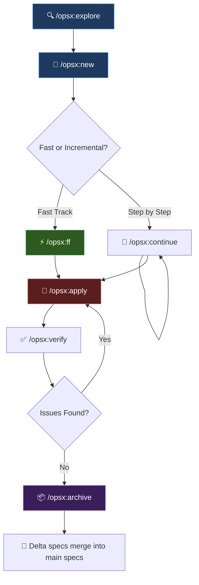
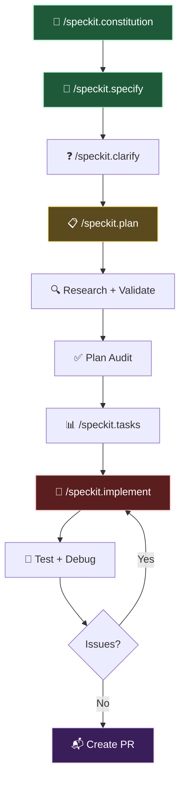

# OpenSpec vs Speckit — Comprehensive Comparison Analysis

> **Spec-Driven Development (SDD)** is a methodology where specifications become the first-class artifact — guiding AI coding assistants to produce predictable, high-quality output instead of "vibe coding" from chat prompts.

Both **OpenSpec** (by Fission AI) and **Speckit** (by GitHub) bring SDD to life, but with very different philosophies, architectures, and developer experiences.


---

## Quick Overview

| Attribute | OpenSpec | Speckit |
|-----------|----------|--------|
| **Organization** | [Fission AI](https://github.com/Fission-AI/OpenSpec) | [GitHub](https://github.com/github/spec-kit) |
| **Language** | TypeScript / Node.js | Python |
| **Package Manager** | npm / pnpm / yarn / bun / nix | uv (Astral) |
| **Prerequisites** | Node.js 20.19+ | Python 3.11+, uv, Git |
| **License** | MIT | MIT |
| **AI Tools Supported** | 20+ | 20+ |
| **Releases** | 33+ | 95+ |
| **Contributors** | 47+ | 76+ |
| **Approach** | Fluid actions, brownfield-first | Structured phases, enterprise-ready |
| **Core Concept** | Change folders + Delta specs | Constitution + Feature specs |
| **Telemetry** | Anonymous (opt-out available) | None mentioned |

---

## 1. Setup

### OpenSpec

```bash
# Global install
npm install -g @fission-ai/openspec@latest

# Initialize in a project
cd your-project
openspec init
```

- **One command** to install globally, one command to init.
- Works with `npm`, `pnpm`, `yarn`, `bun`, and `nix`.
- Generates an `openspec/` directory with `specs/`, `changes/`, and `config.yaml`.
- Auto-detects your AI tool (Claude, Copilot, Cursor, etc.) and installs matching agent instructions.

### Speckit

```bash
# Persistent install (recommended)
uv tool install specify-cli --from git+https://github.com/github/spec-kit.git

# Initialize a new project
specify init my-project --ai claude

# Initialize in current directory
specify init . --ai copilot
```

- Requires **Python 3.11+** and **uv** (Astral's package manager) — additional dependency layer.
- Supports `--ai` flag to choose your agent at init time.
- Creates a `.specify/` directory with `memory/`, `scripts/`, `specs/`, and `templates/`.
- Includes shell scripts for git operations (branch creation, PR setup).

### Comparison Table — Setup

| Criteria | OpenSpec | Speckit |
|----------|----------|--------|
| **Install command** | `npm install -g @fission-ai/openspec@latest` | `uv tool install specify-cli --from git+...` |
| **Runtime** | Node.js 20.19+ | Python 3.11+ + uv + Git |
| **Init command** | `openspec init` | `specify init <name> --ai <agent>` |
| **Dependency overhead** | Minimal (just Node.js) | Higher (Python + uv) |
| **Update mechanism** | `npm install -g @fission-ai/openspec@latest` + `openspec update` | `uv tool install specify-cli --force --from git+...` |
| **Project structure created** | `openspec/` with specs, changes, config | `.specify/` with memory, scripts, templates |
| **Time to first spec** | ~2 minutes | ~5 minutes |

> [!TIP]
> **OpenSpec wins on setup simplicity.** If your team already has Node.js, it's one `npm install`. Speckit adds the overhead of Python + uv, which may not already be in your stack, especially for frontend-heavy teams.

---

## 2. Maintainability

### OpenSpec — Change-Folder Pattern

```
openspec/
├── specs/                  # Source of truth (current system behavior)
│   ├── auth/spec.md
│   ├── payments/spec.md
│   └── ui/spec.md
├── changes/                # Active work (one folder per change)
│   ├── add-dark-mode/
│   │   ├── proposal.md
│   │   ├── design.md
│   │   ├── tasks.md
│   │   └── specs/          # Delta specs (ADDED/MODIFIED/REMOVED)
│   │       └── ui/spec.md
│   └── fix-login-bug/
│       └── ...
└── config.yaml
```

**Key maintainability features:**
- **Delta specs** — Changes describe *what's different*, not the whole spec. Two changes can touch the same spec file without conflicting.
- **Archive system** — Completed changes move to `changes/archive/YYYY-MM-DD-<name>/`, preserving full audit trail.
- **Spec evolution** — On archive, delta specs merge into the main `specs/` directory automatically.
- **Parallel changes** — Multiple developers can work on separate change folders simultaneously.
- **Bulk archive** — `bulk-archive` handles spec conflicts across multiple changes intelligently.

### Speckit — Feature-Branch Spec Pattern

```
.specify/
├── memory/
│   └── constitution.md          # Project principles
├── scripts/
│   ├── check-prerequisites.sh
│   ├── create-new-feature.sh
│   ├── setup-plan.sh
│   └── update-claude-md.sh
├── specs/
│   └── 001-create-taskify/
│       ├── spec.md
│       ├── plan.md
│       ├── research.md
│       ├── tasks.md
│       ├── data-model.md
│       └── contracts/
│           ├── api-spec.json
│           └── signalr-spec.md
└── templates/
    ├── plan-template.md
    ├── spec-template.md
    └── tasks-template.md
```

**Key maintainability features:**
- **Constitution** — Global project principles (`constitution.md`) enforce consistency across all specs.
- **Git-native workflow** — Creates feature branches per spec (`001-create-taskify`), leverages PRs for review.
- **Template-driven** — Standardized templates ensure all specs/plans follow the same structure.
- **Scripts** — Built-in shell scripts automate branch creation, tool checks, and Claude.md updates.
- **Numbered features** — Features are prefixed with sequential numbers (`001-`, `002-`) for ordering.

### Comparison Table — Maintainability

| Criteria | OpenSpec | Speckit |
|----------|----------|--------|
| **Spec evolution** | Delta specs → auto-merge on archive | Manual / git-based |
| **Conflict handling** | Built-in delta merge + bulk-archive | Git merge conflicts |
| **Audit trail** | Archive folder with full change history | Git history + PRs |
| **Parallel work** | First-class (change folders) | Git branches (standard) |
| **Project principles** | No formal mechanism | `constitution.md` |
| **Template system** | Schema-driven (customizable) | Markdown templates |
| **Brownfield support** | First-class (delta specs) | Possible but not primary focus |
| **Spec organization** | By domain (`auth/`, `payments/`) | By feature number (`001-`, `002-`) |

> [!IMPORTANT]
> **OpenSpec excels for brownfield projects** with its delta spec system that tracks changes incrementally. **Speckit excels for greenfield projects** where a strong constitutional framework and templates provide guardrails from day one.

---

## 3. Usability

### OpenSpec — Slash Commands

| Command | Purpose |
|---------|---------|
| `/opsx:explore` | Investigate ideas before committing |
| `/opsx:new` | Start a new change |
| `/opsx:continue` | Create next artifact (incremental) |
| `/opsx:ff` | Fast-forward: create all planning docs at once |
| `/opsx:apply` | Implement tasks from change |
| `/opsx:verify` | Validate implementation matches specs |
| `/opsx:sync` | Merge delta specs into main specs |
| `/opsx:archive` | Archive completed change |
| `/opsx:bulk-archive` | Archive multiple changes at once |
| `/opsx:onboard` | Guided tutorial |

**Workflow flexibility:**

```
Quick feature:  /opsx:new → /opsx:ff → /opsx:apply → /opsx:archive
Exploratory:    /opsx:explore → /opsx:new → /opsx:continue (repeat) → /opsx:apply
Parallel work:  Multiple /opsx:new → context-switch freely → /opsx:bulk-archive
```

### Speckit — Slash Commands

| Command | Purpose |
|---------|---------|
| `/speckit.constitution` | Create project governing principles |
| `/speckit.specify` | Describe what you want to build |
| `/speckit.clarify` | Structured clarification of requirements |
| `/speckit.plan` | Generate technical implementation plan |
| `/speckit.tasks` | Break down plan into tasks |
| `/speckit.implement` | Execute implementation |
| `/speckit.checklist` | Validate spec checklist |
| `/speckit.analyze` | Analyze existing code |
| `/quizme` | Quiz-based validation |

**Workflow (sequential):**

```
/speckit.constitution → /speckit.specify → /speckit.clarify → /speckit.plan → /speckit.tasks → /speckit.implement
```

### Comparison Table — Usability

| Criteria | OpenSpec | Speckit |
|----------|----------|--------|
| **Workflow style** | Fluid — skip/revisit any step | Sequential — 6-step pipeline |
| **Exploration mode** | `/opsx:explore` (dedicated) | Not formalized |
| **Fast track** | `/opsx:ff` (all planning docs at once) | Not available |
| **Verification** | `/opsx:verify` (3-dimension check) | `/quizme` + checklist |
| **Onboarding** | `/opsx:onboard` guided tutorial | Detailed README + video |
| **Context switching** | Built-in (change folders) | Manual (git branches) |
| **Recovery from interruption** | Resume via change name | Re-enter project context |
| **Command namespace** | `/opsx:` prefix | `/speckit.` prefix |

> [!TIP]
> **OpenSpec is more usable for iterative, real-world workflows** — the explore → build → verify → archive loop feels natural. **Speckit's structured pipeline** is better when you want enforced rigor (e.g., regulated industries).

---

## 4. Learning Curve

### OpenSpec

| Aspect | Difficulty | Notes |
|--------|------------|-------|
| Installation | 🟢 Easy | Standard `npm install -g` |
| First usage | 🟢 Easy | `/opsx:new` → `/opsx:ff` → done |
| Concepts | 🟡 Medium | Delta specs, schemas, archive system require understanding |
| Customization | 🟡 Medium | Custom schemas, config.yaml |
| Advanced workflows | 🟡 Medium | Parallel changes, bulk-archive, sync |

**Minimum viable knowledge:** Install → `openspec init` → `/opsx:new` → `/opsx:ff` → `/opsx:apply`. ~15 minutes to first productive use.

### Speckit

| Aspect | Difficulty | Notes |
|--------|------------|-------|
| Installation | 🟡 Medium | Requires Python + uv (extra dependency) |
| First usage | 🟡 Medium | Constitution → specify → clarify → plan → tasks → implement |
| Concepts | 🟡 Medium | Constitution, feature specs, templates, review checklists |
| Customization | 🔴 Hard | Template modification, script customization |
| Advanced workflows | 🔴 Hard | Research steps, parallel tasks, plan validation |

**Minimum viable knowledge:** Install Python + uv → `specify init` → understand 6-step flow → execute each step. ~30 minutes to first productive use.

### Comparison Table — Learning Curve

| Criteria | OpenSpec | Speckit |
|----------|----------|--------|
| **Time to first productive use** | ~15 minutes | ~30 minutes |
| **Prerequisite knowledge** | Node.js basics | Python + uv basics |
| **Concepts to learn** | 5-6 core concepts | 8-10 core concepts |
| **Documentation quality** | Good (structured docs site) | Excellent (detailed README + video) |
| **Onboarding tutorial** | `/opsx:onboard` command | Detailed step-by-step README |
| **Community resources** | Growing (Slack for teams) | Larger (GitHub-backed) |

> [!NOTE]
> **OpenSpec has a gentler learning curve** for getting started quickly. **Speckit has more comprehensive documentation** and examples, but requires more upfront learning of its structured methodology.

---

## 5. Accurate Output

### OpenSpec

- **Delta specs with RFC 2119 keywords** (SHALL, MUST, SHOULD, MAY) — precise requirement language.
- **3-dimension verification** (`/opsx:verify`):
  - **Completeness** — All tasks done, all requirements implemented
  - **Correctness** — Implementation matches spec intent
  - **Coherence** — Design decisions reflected in code
- **Schema-driven artifact generation** — ensures dependency order (proposal → specs → design → tasks).
- **Brownfield awareness** — understands existing codebase context, reduces hallucination.
- Recommends **high-reasoning models** (Opus 4.5, GPT 5.2) for best results.

### Speckit

- **Constitution-based guardrails** — project principles constrain AI output quality.
- **Multi-step refinement** — spec → clarify → plan → validate → tasks (not one-shot).
- **Research step** — AI validates tech stack decisions against real documentation.
- **Plan validation** (`/speckit.checklist`) — human-reviewed acceptance criteria.
- **Template-driven** — standardized output format reduces variance.
- **Quiz-based validation** (`/quizme`) — tests AI understanding of the spec.
- **Over-engineering detection** — built-in prompts to catch AI adding unnecessary complexity.

### Comparison Table — Output Accuracy

| Criteria | OpenSpec | Speckit |
|----------|----------|--------|
| **Requirements precision** | RFC 2119 keywords (SHALL/MUST/SHOULD) | User-story format with checklists |
| **Verification mechanism** | 3-dimension automated verify | Quiz + human checklist review |
| **Spec format** | Given/When/Then scenarios | User stories + acceptance criteria |
| **Research validation** | Not built-in | `/speckit.plan` includes research step |
| **Multi-step refinement** | Optional (continue vs ff) | Required (clarify step) |
| **Model recommendation** | Yes (Opus 4.5, GPT 5.2) | Not explicitly stated |
| **Output consistency** | Schema-driven templates | Markdown templates |

> [!IMPORTANT]
> **Speckit produces more thoroughly validated output** due to its mandatory clarification and multi-step validation pipeline. **OpenSpec produces more precise specs** with RFC 2119 keywords and Given/When/Then scenarios, but relies on the user to choose verification depth.

---

## 6. Time to Market

### OpenSpec — Optimized for Speed

```
Fast track:     /opsx:new → /opsx:ff → /opsx:apply → /opsx:archive
Estimated time: 15-30 min for a small feature
```

- **`/opsx:ff`** generates all planning artifacts in one pass — no waiting between steps.
- **Parallel changes** — work on multiple features simultaneously without git branch overhead.
- **Context-switch friendly** — jump between changes by name.
- **Resume-able** — interrupted work picks up where it left off via task checkboxes.
- **Minimal ceremony** — no constitution or research steps required.

### Speckit — Optimized for Thoroughness

```
Full pipeline:   constitution → specify → clarify → plan → validate → tasks → implement
Estimated time:  1-3 hours for a small feature (including human review)
```

- **More steps = more overhead** — but each step catches potential issues early.
- **Research step** prevents building with outdated/wrong APIs.
- **Plan validation** catches over-engineering before code is written.
- **Constitution reuse** — once established, principles apply to all future features.
- **GitHub PR integration** — review workflow built-in.

### Comparison Table — Time to Market

| Criteria | OpenSpec | Speckit |
|----------|----------|--------|
| **Small feature (< 1 day)** | 🟢 15-30 min | 🟡 1-3 hours |
| **Medium feature (1-3 days)** | 🟢 1-4 hours | 🟡 4-8 hours |
| **Large feature (1+ week)** | 🟡 Same | 🟢 Slightly better (fewer rework cycles) |
| **Parallel development** | 🟢 Built-in | 🟡 Via git branches |
| **Context switching cost** | 🟢 Low (change folders) | 🟡 Medium (branch switching) |
| **Upfront investment** | 🟢 Low | 🔴 High (constitution, templates) |
| **Rework reduction** | 🟡 Moderate | 🟢 High (multi-step validation) |

> [!TIP]
> **OpenSpec is faster for small/medium features** with its fast-forward workflow. **Speckit is better for large, complex features** where upfront investment in planning reduces costly rework downstream.

---

## 7. Single Repo vs Multi-Repo Support

This is a critical distinction for enterprise teams managing microservices, monorepos, or polyglot architectures.

### OpenSpec — Single & Multi-Repo

| Aspect | Single Repo | Multi-Repo |
|--------|-------------|------------|
| **Setup** | `openspec init` in project root | `openspec init` in each repo |
| **Spec sharing** | Domain-based specs in `openspec/specs/` | Each repo has own `openspec/specs/` |
| **Cross-repo changes** | Not first-class; manual coordination | Independent per repo |
| **Monorepo support** | Domain-based organization works well | N/A |
| **Parallel changes** | ✅ Built-in (change folders) | ✅ Per-repo change folders |
| **Spec conflicts** | ✅ Delta merge handles | N/A across repos |
| **Config sharing** | `config.yaml` per project | Separate configs per repo |

**Strengths for multi-repo:**
- Lightweight init per repo — low overhead.
- Each repo is self-contained with its own spec lifecycle.
- No cross-repo dependency; works well for independent microservices.

**Weaknesses for multi-repo:**
- No built-in mechanism to share specs across repos.
- Cross-service contract changes require manual coordination.
- No centralized spec registry.

### Speckit — Single & Multi-Repo

| Aspect | Single Repo | Multi-Repo |
|--------|-------------|------------|
| **Setup** | `specify init .` in project root | `specify init` in each repo |
| **Spec sharing** | Feature-based specs in `.specify/specs/` | Each repo has own `.specify/` |
| **Cross-repo changes** | Not first-class; managed via git | Git submodule / shared templates possible |
| **Monorepo support** | Works but feature numbering can conflict | N/A |
| **Parallel changes** | Via git branches | Via git branches per repo |
| **Spec conflicts** | Git merge conflicts | Standard git workflow |
| **Config sharing** | Constitution is per-project | Can share constitution via git submodule |

**Strengths for multi-repo:**
- **Constitution can be templated** and shared across repos for consistency.
- **Git-native workflow** — standard multi-repo git patterns apply.
- **Enterprise scripts** can be standardized across repos.
- Template reuse across repos via shared template repositories.

**Weaknesses for multi-repo:**
- Heavier per-repo overhead (Python + uv needed everywhere).
- Constitution duplication unless managed via submodules.
- No built-in cross-repo spec synchronization.

### Comparison Table — Repo Strategy

| Criteria | OpenSpec | Speckit |
|----------|----------|--------|
| **Single repo ease** | 🟢 Excellent | 🟢 Good |
| **Multi-repo ease** | 🟡 Good (lightweight) | 🟡 Good (git-native) |
| **Monorepo suitability** | 🟢 Great (domain-based specs) | 🟡 Good (may need numbering strategy) |
| **Cross-repo spec sharing** | 🔴 Not built-in | 🟡 Via git submodules |
| **Per-repo overhead** | 🟢 Low (Node.js only) | 🔴 High (Python + uv) |
| **Template/config reuse** | 🟡 Custom schemas | 🟢 Git submodule templates |
| **Enterprise standardization** | 🟡 Config + schemas | 🟢 Constitution + templates + scripts |

> [!WARNING]
> **Neither tool natively supports cross-repo spec synchronization.** For multi-repo microservice architectures, you'll need to build your own coordination layer (e.g., a shared spec repo, CI-based sync, or API contract testing).

---

## 8. Additional Comparison Dimensions

### Community & Ecosystem

| Criteria | OpenSpec | Speckit |
|----------|----------|--------|
| **Backing** | Fission AI (startup) | GitHub (Microsoft) |
| **Community size** | Growing (47 contributors) | Larger (76 contributors, 95 releases) |
| **Support channel** | Slack (for teams), GitHub Issues | GitHub Issues |
| **Documentation** | Structured docs (concepts, workflows, commands) | Extensive README + spec-driven.md |
| **Video resources** | Not mentioned | YouTube video overview |
| **Website** | [openspec.dev](https://openspec.dev) | [github.github.com/spec-kit](https://github.github.com/spec-kit/) |

### Extensibility & Customization

| Criteria | OpenSpec | Speckit |
|----------|----------|--------|
| **Custom workflows** | ✅ Custom schemas (YAML) | ⚠️ Template modification |
| **Custom artifact types** | ✅ Schema-defined | ⚠️ Manual template addition |
| **Config file** | `openspec/config.yaml` | `.specify/memory/constitution.md` |
| **Plugin system** | Not mentioned | Not mentioned |
| **Multi-language support** | ✅ Documented | Not mentioned |

### Security & Compliance

| Criteria | OpenSpec | Speckit |
|----------|----------|--------|
| **Telemetry** | ⚠️ Anonymous usage stats (opt-out: `OPENSPEC_TELEMETRY=0`) | ✅ None mentioned |
| **Audit trail** | ✅ Archive with full change history | ✅ Git history + PRs |
| **Enterprise governance** | 🟡 Via config | 🟢 Constitution + compliance support |
| **License** | MIT | MIT |

### AI Tool Integration Depth

Both tools support **20+ AI coding assistants**. Here's a comparative list:

| AI Tool | OpenSpec | Speckit |
|---------|----------|--------|
| Claude Code | ✅ | ✅ |
| GitHub Copilot | ✅ | ✅ |
| Cursor | ✅ | ✅ |
| Gemini CLI | ✅ | ✅ |
| Windsurf | ✅ | ✅ |
| Codex CLI | ✅ | ✅ |
| Amazon Q | ✅ | ✅ |
| Roo Code | ✅ | ✅ |
| Amp | ✅ | ✅ |
| Qwen Code | ✅ | ✅ |
| Kilo Code | ✅ | ✅ |
| IBM Bob | ✅ | ✅ |
| Antigravity (agy) | ✅ | ✅ |

---

## Workflow Architecture Diagrams

### OpenSpec Flow



### Speckit Flow



---

## Final Verdict — Decision Matrix

| Criteria | Weight | OpenSpec | Speckit | Winner |
|----------|--------|----------|--------|--------|
| **Setup** | 15% | ⭐⭐⭐⭐⭐ | ⭐⭐⭐ | OpenSpec |
| **Maintainability** | 20% | ⭐⭐⭐⭐ | ⭐⭐⭐⭐ | Tie |
| **Usability** | 15% | ⭐⭐⭐⭐⭐ | ⭐⭐⭐ | OpenSpec |
| **Learning Curve** | 10% | ⭐⭐⭐⭐⭐ | ⭐⭐⭐ | OpenSpec |
| **Accurate Output** | 20% | ⭐⭐⭐⭐ | ⭐⭐⭐⭐⭐ | Speckit |
| **Time to Market** | 10% | ⭐⭐⭐⭐⭐ | ⭐⭐⭐ | OpenSpec |
| **Multi-Repo** | 10% | ⭐⭐⭐⭐ | ⭐⭐⭐ | OpenSpec |

### Recommendation by Team Profile

| Team Profile | Recommendation | Reasoning |
|-------------|---------------|-----------|
| **Startup / Small team** | 🟢 **OpenSpec** | Faster setup, lower ceremony, quicker time to market |
| **Enterprise / Regulated** | 🟢 **Speckit** | Constitution-based governance, thorough validation, compliance support |
| **Frontend-heavy team** | 🟢 **OpenSpec** | Node.js native, no Python dependency |
| **Python/ML team** | 🟢 **Speckit** | Python native, familiar tooling |
| **Brownfield project** | 🟢 **OpenSpec** | Delta specs designed for evolving systems |
| **Greenfield project** | 🟢 **Speckit** | Constitution + templates provide strong foundation |
| **Microservices (multi-repo)** | 🟡 **OpenSpec** (slight edge) | Lower per-repo overhead |
| **Monorepo** | 🟢 **OpenSpec** | Domain-based spec organization fits monorepo patterns |
| **Solo developer** | 🟢 **OpenSpec** | Minimal ceremony, fast iteration |
| **Large team (10+)** | 🟢 **Speckit** | Governance, review processes, standardized templates |

---

## Pros & Cons Summary

### OpenSpec

| ✅ Pros | ❌ Cons |
|---------|---------|
| Lightweight install (npm) | No constitution/governance framework |
| Fluid, non-linear workflow | Anonymous telemetry (though opt-out available) |
| Delta specs for brownfield | Less opinionated (more room for inconsistency) |
| Parallel change support | No built-in research step |
| Fast-forward mode for speed | Smaller community (growing) |
| 3-dimension verification | No cross-repo spec sharing |
| Explorer mode for unclear requirements | Newer, less battle-tested |
| Custom schemas for extensibility | No built-in PR/review integration |

### Speckit

| ✅ Pros | ❌ Cons |
|---------|---------|
| GitHub-backed (strong community) | Heavier setup (Python + uv) |
| Constitution-based governance | Rigid sequential workflow |
| Thorough validation pipeline | Slower time to first spec |
| Built-in research step | No fast-forward mode |
| Quiz-based validation | No explorer/investigation mode |
| Template standardization | No delta spec system |
| Git PR integration | Higher per-repo overhead for multi-repo |
| Over-engineering detection | No built-in verify command |

---

> [!NOTE]
> **Both tools are actively developed and maturing rapidly.** This analysis is based on their state as of February 2026. Features and capabilities may evolve significantly. Check the respective GitHub repositories for the latest updates.

## References

- [OpenSpec GitHub](https://github.com/Fission-AI/OpenSpec)
- [OpenSpec Website](https://openspec.dev/)
- [Speckit GitHub](https://github.com/github/spec-kit)
- [Speckit Website](https://github.github.com/spec-kit/)
- [Speckit Spec-Driven Methodology](https://github.com/github/spec-kit/blob/main/spec-driven.md)
