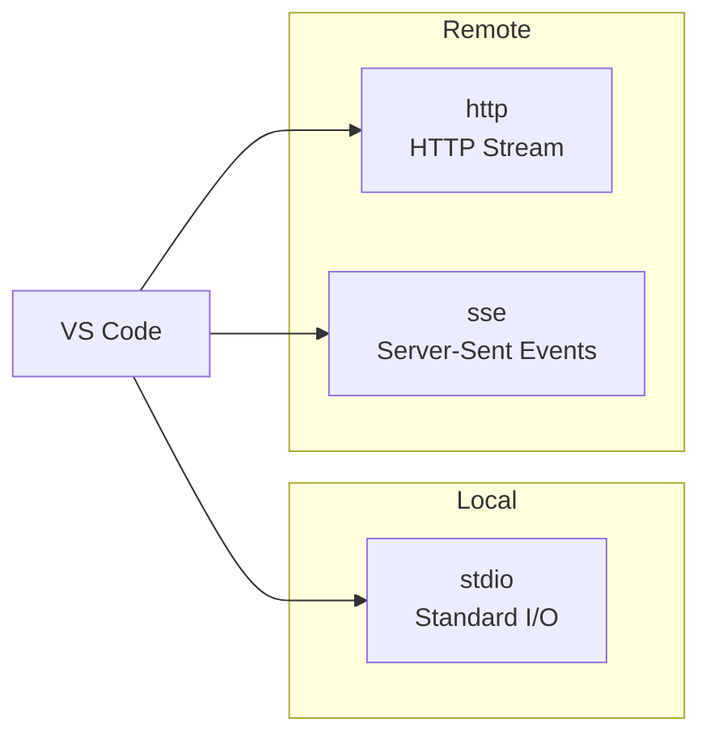
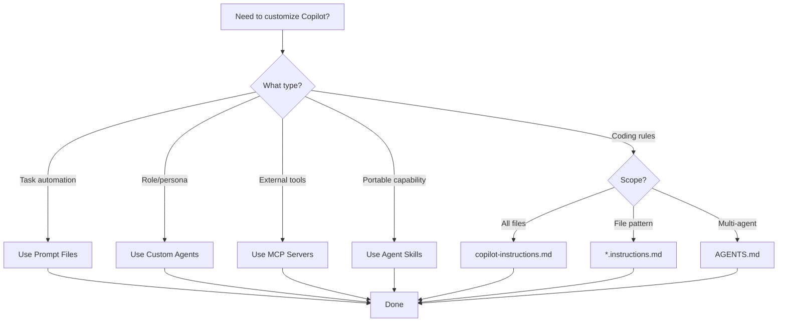

# Technology Stack Analysis

> **Comparison of VS Code Copilot Customization Technologies**

This document provides a detailed analysis of the technology choices in VS Code Copilot's customization system.

---

## Core Technologies

### 1. Markdown-Based Configuration

**Choice:** Markdown with YAML Frontmatter

| Technology | Pros | Cons |
|------------|------|------|
| **Markdown + YAML** (Chosen) | Human-readable, version control friendly, familiar to developers, supports rich formatting | Limited validation, no schema enforcement |
| JSON | Strict structure, better tooling | Poor readability for long content |
| YAML only | Good for config | Not ideal for instruction content |
| Custom DSL | Purpose-built | Learning curve, tooling needed |

**Rationale:**
- Instructions contain natural language - Markdown is ideal
- YAML frontmatter provides structured metadata
- Git-friendly for team collaboration
- No additional tooling required

---

### 2. File Extension Strategy

```
┌──────────────────────────┬────────────────────┬─────────────────────────┐
│ Extension                │ Type              │ Purpose                  │
├──────────────────────────┼────────────────────┼─────────────────────────┤
│ *.instructions.md        │ Pattern-matched   │ Conditional guidelines   │
│ *.prompt.md              │ On-demand         │ Reusable task prompts    │
│ *.agent.md               │ Persona           │ Specialized AI roles     │
│ SKILL.md                 │ Capability        │ Portable skills          │
│ mcp.json                 │ Integration       │ External tools           │
│ copilot-instructions.md  │ Global            │ Always-on instructions   │
│ AGENTS.md                │ Cross-platform    │ Multi-agent compatible   │
└──────────────────────────┴────────────────────┴─────────────────────────┘
```

**Why Multiple Extensions?**
- Clear semantic meaning from filename
- Easy to identify purpose in file explorer
- IDE tooling can provide specialized support
- Progressive disclosure of complexity

---

### 3. Model Context Protocol (MCP)

**Choice:** MCP as the External Tool Standard

| Protocol | Pros | Cons |
|----------|------|------|
| **MCP** (Chosen) | Open standard, growing ecosystem, multiple transports | Relatively new, evolving spec |
| Custom API | Full control | Not portable, maintenance burden |
| OpenAPI/REST | Widely understood | No AI-specific features |
| GraphQL | Flexible queries | Overhead for simple tools |

**Supported Transports:**



**MCP Features Supported:**
- ✅ Tools
- ✅ Prompts
- ✅ Resources
- ✅ Elicitation
- ✅ Sampling
- ✅ Authentication
- ✅ Server Instructions
- ✅ Roots

---

### 4. Agent Skills Standard

**Choice:** Open Standard via agentskills.io

| Approach | Pros | Cons |
|----------|------|------|
| **Agent Skills** (Chosen) | Portable across tools, open standard, community-driven | Preview status, ecosystem building |
| VS Code-specific | Optimized for VS Code | Not portable |
| Plugin system | Extensible | More complex to create |

**Portability:**
```
┌─────────────────┐
│  Agent Skills   │
│    SKILL.md     │
└────────┬────────┘
         │
    ┌────┴────┬──────────────┐
    ▼         ▼              ▼
┌───────┐ ┌───────────┐ ┌──────────────┐
│VS Code│ │GitHub CLI │ │Coding Agent  │
└───────┘ └───────────┘ └──────────────┘
```

---

### 5. Language Model Integration

**Architecture:** Provider-Agnostic with BYOK Support

```
┌─────────────────────────────────────────────────────────────────┐
│                    MODEL PROVIDERS                              │
├─────────────────────────────────────────────────────────────────┤
│                                                                 │
│  ┌─────────────────┐  ┌─────────────────┐  ┌────────────────┐ │
│  │ Built-in        │  │ BYOK            │  │ Extensions     │ │
│  │                 │  │                 │  │                │ │
│  │ • Claude family │  │ • OpenAI        │  │ • AI Toolkit   │ │
│  │ • GPT family    │  │ • Anthropic     │  │ • Ollama       │ │
│  │ • Gemini family │  │ • Azure OpenAI  │  │ • Custom       │ │
│  │                 │  │ • Any OpenAI-   │  │   providers    │ │
│  │                 │  │   compatible    │  │                │ │
│  └─────────────────┘  └─────────────────┘  └────────────────┘ │
│                                                                 │
│  ┌─────────────────────────────────────────────────────────┐   │
│  │                  AUTO MODEL SELECTION                    │   │
│  │                                                          │   │
│  │  Automatically selects optimal model based on:          │   │
│  │  • Task complexity     • Rate limits                    │   │
│  │  • Model availability  • Performance                    │   │
│  └─────────────────────────────────────────────────────────┘   │
│                                                                 │
└─────────────────────────────────────────────────────────────────┘
```

---

## Comparison: Instructions vs Agents vs Skills

| Feature | Custom Instructions | Custom Agents | Agent Skills |
|---------|-------------------|---------------|--------------|
| **Primary Use** | Coding standards | Role-based behavior | Specialized workflows |
| **Scope** | Pattern-matched files | Entire session | Task-specific |
| **Auto-Apply** | Yes (with applyTo) | No (user selects) | Auto (when relevant) |
| **Tools Control** | No | Yes | No |
| **Model Control** | No | Yes | No |
| **Portability** | VS Code | VS Code | Cross-platform |
| **Resources** | Referenced files | Referenced files | Bundled files |
| **Handoffs** | No | Yes | No |

---

## Comparison: Prompts vs Instructions

| Aspect | Prompt Files | Instruction Files |
|--------|--------------|-------------------|
| **Trigger** | Manual (/command) | Automatic |
| **Purpose** | Task execution | Guidelines |
| **Variables** | Yes (${input:}, etc.) | No |
| **Agent Override** | Yes | No |
| **Model Override** | Yes | No |
| **Tool Override** | Yes | No |
| **Typical Use** | "Generate a component" | "Use PascalCase" |

---

## Technology Selection Framework



---

## Storage Technology

### File Locations by Scope

| Scope | Location | Sync Support |
|-------|----------|--------------|
| Workspace | `.github/` folders | Git |
| User Profile | VS Code profile directory | Settings Sync |
| Organization | GitHub organization | GitHub |

### Settings Sync Support

Enabled via `Settings Sync: Configure`:
- ✅ Prompts and Instructions
- ✅ MCP Servers
- ✅ User Profile customizations

---

## Security Framework

### Trust Model

```
┌────────────────────────────────────────────────────────────────┐
│                    TRUST HIERARCHY                             │
├────────────────────────────────────────────────────────────────┤
│                                                                │
│  Level 1: Implicit Trust                                       │
│  ─────────────────────                                         │
│  • Workspace instruction files                                 │
│  • Workspace prompt files                                      │
│  • Workspace agent files                                       │
│                                                                │
│  Level 2: First-Run Trust                                      │
│  ────────────────────────                                      │
│  • MCP servers (prompted on first use)                        │
│  • Can reset via "MCP: Reset Trust"                           │
│                                                                │
│  Level 3: External Review                                      │
│  ────────────────────────                                      │
│  • Shared skills (review before use)                          │
│  • Community contributions                                     │
│                                                                │
└────────────────────────────────────────────────────────────────┘
```

### Input Variable Security

```json
{
  "inputs": [
    {
      "type": "promptString",
      "id": "api-key",
      "description": "API Key",
      "password": true  // Masks input, stores securely
    }
  ]
}
```

---

## Recommendation Summary

| Requirement | Recommended Technology |
|-------------|----------------------|
| Team coding standards | `.github/copilot-instructions.md` |
| Language-specific rules | `*.instructions.md` with glob patterns |
| Automated code generation | Prompt files |
| Planning workflow | Custom agent with handoffs |
| Database integration | MCP server |
| Cross-tool testing workflow | Agent Skills |
| Model optimization | Auto model selection or explicit override |

---

*This analysis reflects the current state of VS Code Copilot customization as of VS Code 1.106+*
