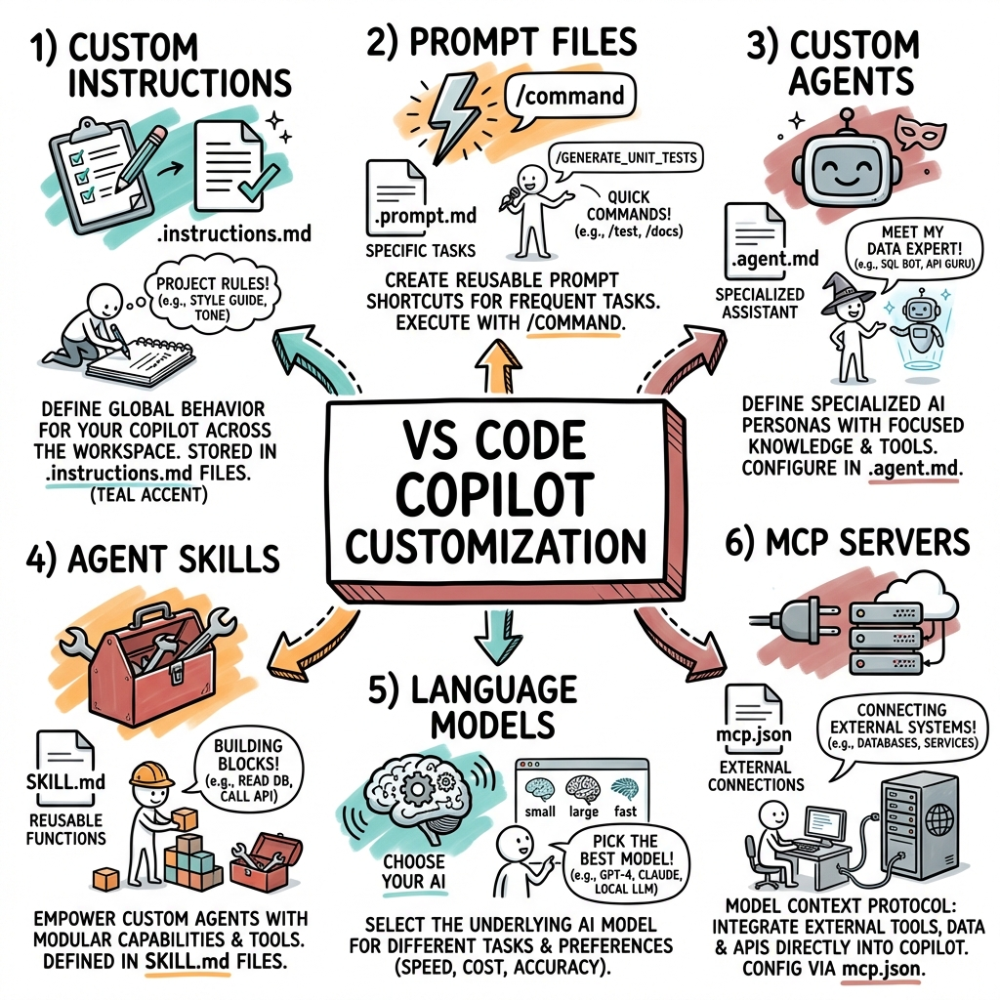
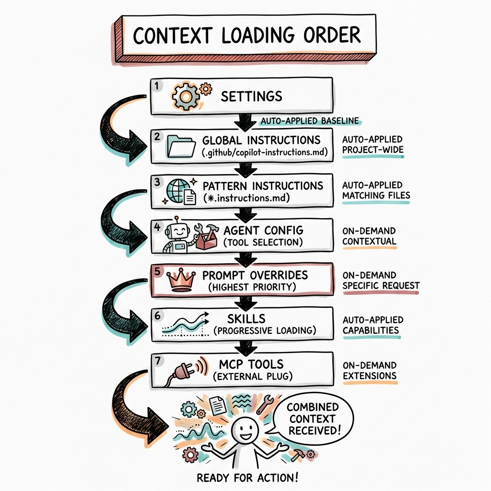
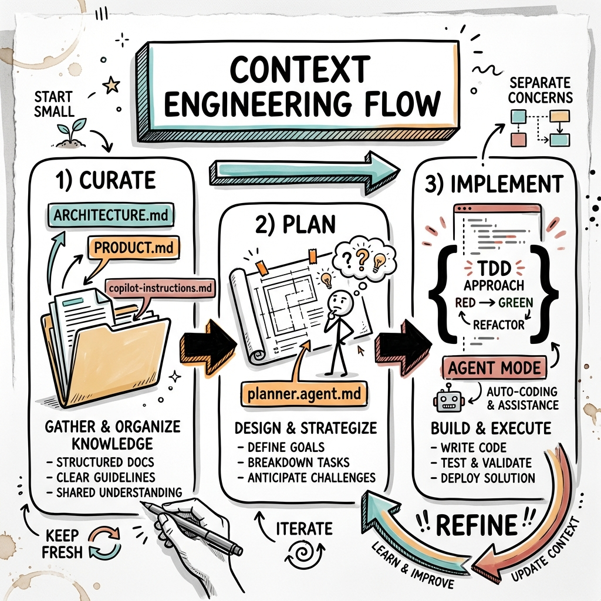

# VS Code Copilot Customization - Walkthrough

> **Developer Guide to Implementing AI-Assisted Development Workflows**

This guide walks you through setting up and using VS Code Copilot customization features.

---

## Visual Overview

### Six Customization Types



The six customization mechanisms work together to create a tailored AI coding experience:
1. **Custom Instructions** - Auto-applied coding guidelines
2. **Prompt Files** - Reusable task templates
3. **Custom Agents** - Specialized AI personas
4. **Agent Skills** - Portable capabilities
5. **Language Models** - AI model selection
6. **MCP Servers** - External tool integration

---

### Context Loading Order



Understanding how context is assembled helps you structure customizations effectively:
1. Settings-based instructions load first
2. Global instructions apply to all requests
3. Pattern instructions apply to matching files
4. Agent configuration adds role-specific context
5. Prompt overrides have highest priority
6. Skills load progressively based on relevance
7. MCP tools extend available capabilities

---

### Context Engineering Workflow



A complete AI-assisted development workflow follows three phases:
1. **Curate** - Organize project knowledge
2. **Plan** - Design before implementing
3. **Implement** - Build with TDD approach

---

## Quick Start

### Step 1: Enable Instruction Files

First, ensure instruction files are enabled in VS Code:

```json
// .vscode/settings.json
{
  "github.copilot.chat.codeGeneration.useInstructionFiles": true
}
```

### Step 2: Create Global Instructions

Create your project's coding constitution:

```bash
mkdir -p .github
touch .github/copilot-instructions.md
```

Add your project standards:

```markdown
# Project Guidelines

## Technology Stack
- Framework: [Your framework]
- Language: [Your language]

## Coding Standards
- Follow [style guide]
- Use [patterns]
- Test with [framework]
```

### Step 3: Add Pattern-Based Instructions

Create language/framework-specific rules:

```bash
mkdir -p .github/instructions
```

Example for Java:
```markdown
---
applyTo: "**/*.java"
---
# Java Standards
- Use Java 21+ features
- Follow Google Java Style
```

### Step 4: Create Reusable Prompts

Add common development tasks:

```bash
mkdir -p .github/prompts
```

Example component generator:
```markdown
---
description: "Generate new component"
agent: "agent"
---
Create a new component named ${input:name}...
```

### Step 5: Define Custom Agents

Create specialized personas:

```bash
mkdir -p .github/agents
```

Example planner:
```markdown
---
description: "Planning agent"
tools: ['codebase', 'search']
---
You are a planner. Generate implementation plans...
```

---

## Project Structure Template

```
your-project/
├── .github/
│   ├── copilot-instructions.md     ← Global standards
│   ├── instructions/
│   │   ├── java.instructions.md    ← Java rules
│   │   └── react.instructions.md   ← React rules
│   ├── prompts/
│   │   ├── create-api.prompt.md    ← API generator
│   │   └── review.prompt.md        ← Code review
│   ├── agents/
│   │   ├── planner.agent.md        ← Planning agent
│   │   └── reviewer.agent.md       ← Review agent
│   └── skills/
│       └── testing/
│           └── SKILL.md            ← Testing skill
├── mcp.json                         ← MCP servers
└── .vscode/
    └── settings.json                ← VS Code config
```

---

## Sample Configurations

This project includes complete samples for:

### Spring Boot Applications
- [Global Instructions](samples/springboot/copilot-instructions.md)
- [Java Standards](samples/springboot/java.instructions.md)
- [Controller Generator](samples/springboot/create-controller.prompt.md)
- [Planner Agent](samples/springboot/planner.agent.md)
- [API Testing Skill](samples/springboot/api-testing/SKILL.md)

### React + Salt Design System
- [Global Instructions](samples/react-salt/copilot-instructions.md)
- [React Standards](samples/react-salt/react.instructions.md)
- [Component Generator](samples/react-salt/create-component.prompt.md)
- [Reviewer Agent](samples/react-salt/reviewer.agent.md)
- [UI Testing Skill](samples/react-salt/ui-testing/SKILL.md)

---

## Using Customizations

### Run a Prompt File
Type `/` in chat followed by the prompt name:
```
/create-controller
```

### Switch to Custom Agent
Select from the agents dropdown or type:
```
@planner Help me design...
```

### Reference Tools in Chat
```
Use #tool:codebase to search for patterns
```

---

## Tips for Success

1. **Start Simple** - Begin with global instructions, add complexity gradually
2. **Be Specific** - Clear instructions produce better results
3. **Iterate** - Refine based on AI behavior
4. **Share** - Commit customizations for team benefit
5. **Update** - Keep instructions current with codebase

---

## Related Documentation

- [Main Guide](Prompt.md) - Complete customization reference
- [Architecture](architecture.md) - System design overview
- [Tech Stack](tech_stack.md) - Technology comparisons

---

*For more community examples, visit [Awesome Copilot](https://github.com/github/awesome-copilot)*
